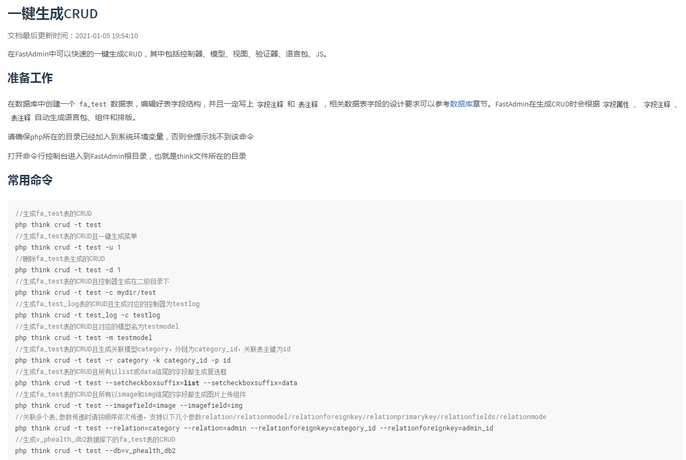

## fastadmin

fastadmin：以TP5为基础的），把框架里免费的插件安装上学一学，开发文档看完，跟着操作一遍，多写写API接口；

第六天：了解一些并发、缓存、数据库优化等知识；
第七天：看看网上大神的PHP技能树进阶，准备一份看起来还行的简历，等面试吧；

## 密码
数据库修改fa_admin表的两个字段
密码(password)：c13f62012fd6a8fdf06b3452a94430e5
密码盐(salt)：rpR6Bv
登录密码是 123456
## 命令行
### 一键生成CURD

