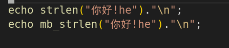

# php
## 服务器相关信息
### $_SERVER 
服务器与执行环境的信息
### $_GET
通过URL参数获取查询字符串数组
### $_POST
当 HTTP Content-Type 是 application/x-www-form-urlencoded or multipart/form-data 的方式时，可以得到 POST 方法的关联数组   
### $_FILES
通过 POST 方法上传文件，返回文件相关的关联数组
```
<form enctype="multipart/form-data" action="__URL__" method="POST">
```

### $_COOKIE
通过 HTTP Cookies 传给当前脚本的关联数组，cookie 会自动上传 ，除非浏览器禁止
```
//设置cookie
setcookie("user", "runoob", $expire);
``` 
### $_SESSION
session是保存在服务器端的，可避免浏览器的限制, 
设置或获取 Session 都要先 执行 session_start();
```
session_start(); 
$_SESSION["newsession"]=$value;
```
### $_REQUEST
### $_ENV
! 在命令行中能够返回环境变量
## 错误信息
ini_set("display_errors","On");
error_reporting(E_ALL); 


## 验证
### 验证Email
```php
<?php
$input = 'john@example.com';
$isEmail = filter_var($input, FILTER_VALIDATE_EMAIL); 
if ($isEmail !== false) {
    echo "Success"; 
}else{
    echo "Fail"; 
}
```
## HTTP Header
重定向
```
// Redirect to login page
 header('HTTP/1.1 302 Redirect');
 header('Location: /login.php');
 ```
404
```
header('HTTP/1.1 400 Bad request');
```

# 入门指南
## 使用内置的Web服务器 (文件提供工具)
> php -S localhost:8000

# 依赖管理
## composer

 中文镜像
> composer config -g repo.packagist composer https://packagist.laravel-china.org

安装依赖
> composer require twig/twig:~1.8

安装全局依赖（安装全局程序）
> composer global require phpunit/phpunit

# 开发实践
## 日期和时间

```
<?php
$raw = '22. 11. 1968';
$start = DateTime::createFromFormat('d. m. Y', $raw);

echo 'Start date: ' . $start->format('Y-m-d') . "\n";
``` 
## 使用 UTF-8  编码
获取长度 ，使用 mb_strlen


## 数据库层面的 UTF-8
使用 utf8mb4 字符集 ，而非 utf8 ，可以得到完整的 UTF-8 支持

## 浏览器层面的 UTF-8

``` 
<?php
// Tell PHP that we're using UTF-8 strings until the end of the script
mb_internal_encoding('UTF-8');
 
// Tell PHP that we'll be outputting UTF-8 to the browser
mb_http_output('UTF-8');
 
// Our UTF-8 test string
$string = 'Êl síla erin lû e-govaned vîn.';
 
// Transform the string in some way with a multibyte function
// Note how we cut the string at a non-Ascii character for demonstration purposes
$string = mb_substr($string, 0, 15);
 
// Connect to a database to store the transformed string
// See the PDO example in this document for more information
// Note the `charset=utf8mb4` in the Data Source Name (DSN)
$link = new PDO(
    'mysql:host=your-hostname;dbname=your-db;charset=utf8mb4',
    'your-username',
    'your-password',
    array(
        PDO::ATTR_ERRMODE => PDO::ERRMODE_EXCEPTION,
        PDO::ATTR_PERSISTENT => false
    )
);
 
// Store our transformed string as UTF-8 in our database
// Your DB and tables are in the utf8mb4 character set and collation, right?
$handle = $link->prepare('insert into ElvishSentences (Id, Body) values (?, ?)');
$handle->bindValue(1, 1, PDO::PARAM_INT);
$handle->bindValue(2, $string);
$handle->execute();
 
// Retrieve the string we just stored to prove it was stored correctly
$handle = $link->prepare('select * from ElvishSentences where Id = ?');
$handle->bindValue(1, 1, PDO::PARAM_INT);
$handle->execute();
 
// Store the result into an object that we'll output later in our HTML
$result = $handle->fetchAll(\PDO::FETCH_OBJ);

header('Content-Type: text/html; charset=UTF-8');
?><!doctype html>
<html>
    <head>
        <meta charset="UTF-8">
        <title>UTF-8 test page</title>
    </head>
    <body>
        <?php
        foreach($result as $row){
            print($row->Body);  // This should correctly output our transformed UTF-8 string to the browser
        }
        ?>
    </body>
</html>

```

# 依赖注入 (解耦的设计模式)

# 数据库

# 使用模板 (前后台分离了，现在 用 REST 了)

# 错误与异常

```
php -a
php > echo $foo;
Notice: Undefined variable: foo in php shell code on line 1
```

php 对错误比较松，修改错误报告行为
> error_reporting(E_ERROR | E_WARNING);

# 安全
password_hash() 已经帮你处理好了加盐

# 数据过滤

filter_var() 和 filter_input() 函数可以过滤文本并对格式进行校验

# 错误报告
## 开发环境
```
display_errors = On
display_startup_errors = On
error_reporting = -1
log_errors = On
```
## 生产环境
```
display_errors = Off
display_startup_errors = Off
error_reporting = E_ALL
log_errors = On
```

# 测试驱动开发 

## 单元测试
PHPUnit

# 服务器与部署
## PaaS (platform as a service)
## 虚拟或专用服务器
### nginx 和 PHP-FPM

# 构建及部署应用
## 构建自动化工具  (我好像很少用)
Phing

# 虚拟化技术 
如果你是在 Windows 下开发, 线上环境是 Linux (或者别的非 Windows 系统) 的话, 或者团队协同开发的时候, 建议使用虚拟机.
## Docker

下面的命令, 会下载一个功能齐全的 Apache 和 最新版本的 PHP, 并会设置 WEB 目录 /path/to/your/php/files 运行在 http://localhost:8080:

> docker run -d --name my-php-webserver -p 8080:80 -v /path/to/your/php/files:/var/www/html/ php:apache

# 缓存
## 对象缓存
### Memcached
### redis

# 代码注释
## PHPDoc
PHPDoc 是注释 PHP 代码的非正式标准。它有许多不同的标记可以使用。

```
@author 标记是用來说明代码的作者，在多位开发者的情况下，可以同时列出好几位。
@link 标记用来提供网站链接，进一步说明代码和网站之间的关系
@param 标记，说明类型、名字和传入方法的参数。
@return 和 @throws 标记说明返回类型以及可能抛出的异常。
```

# 框架
# 组件