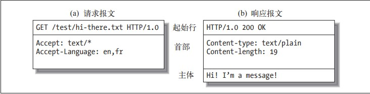

网络(Web)： 客户(使用客户程序) ，使用HTTP协议向 服务商 提交 某种资源请求(url)，服务商（通过服务器程序）向客户进行反馈的一个过程（闭环）

# HTTP
## 客户端
### 媒体类型 (标记媒体的类型)
从 MIME（Multipurpose Internet Mail Extension，多用途因特网邮件扩展） 借鉴而来

> Web 服务器会为所有 HTTP 对象数据附加一个 MIME 类型
> MIME 类型是一种文本标记，表示一种主要的对象类型和一个特定的子类型，中间由一条斜杠来分隔。

- HTML 格式的文本文档由 text/html 类型来标记
- 普通的 ASCII 文本文档由 text/plain 类型来标记

### URL 与资源
URL 用来用特定程序定位资源
>protocol :// hostname[:port] / path / [;parameters][?query]#fragment

#### url特殊编码
- %转义 
| 字符 |   ascii码 | 示例                               |
|------+-----------+------------------------------------|
| ~    | 126(0x7E) | http://aming.xyz/%7Ejoe            |
| 空格 |  32(0x20) | http://aming.xyz/more%20tools.html |
| %    |  37(0x25) | http://aming.xyz/100%25satis.html  |
 
#### 常用方案
| 协议   | 含义                                                           |
|--------+----------------------------------------------------------------|
| file   | 资源是本地计算机上的文件。格式file:///，注意后边应是三个斜杠。 |
| ftp    | 通过 FTP访问资源。格式 FTP://                                  |
| gopher | 通过 Gopher 协议访问该资源。                                   |
| http   | 通过 HTTP 访问该资源。 格式 HTTP://                            |
| https  | 通过安全的 HTTPS 访问该资源。 格式 HTTPS://                    |
| mailto | 资源为电子邮件地址，通过 SMTP 访问。 格式 mailto:              |

### HTTP报文
 

- 请求报文
- 响应报文

| 结构     |
|----------|
| 报文首部 |
| 空行     |
| 报文主体 |

#### HTTP请求方法
| HTTP方法 | 描　　述                                         |
|----------+--------------------------------------------------|
| GET      | 从服务器向客户端发送命名资源                     |
| PUT      | 将来自客户端的数据存储到一个命名的服务器资源中去 |
| DELETE   | 从服务器中删除命名资源                           |
| POST     | 将客户端数据发送到一个服务器网关应用程序         |
| HEAD     | 仅发送命名资源响应中的 HTTP 首部                 |
#### 响应状态码
| HTTP状态码 | 描　　述                                 |
|------------+------------------------------------------|
|        200 | OK。文档正确返回                         |
|        302 | Redirect（重定向）。到其他地方去获取资源 |
|        404 | Not Found（没找到）。无法找到这个资源    |

### 连接管理

- TCP/IP 对报文进行分组

对TCP连接进行编程所需的常见套接字接口函数

| 套接字API调用               | 描　　述                                     |
|-----------------------------+----------------------------------------------|
| s = socket(<parameters>)    | 创建一个新的、未命名、未关联的套接字         |
| bind(s,<local IP:port>)     | 向套接字赋一个本地端口号和接口               |
| connect(s,<remote IP:port>) | 创建一条连接本地套接字与远程主机及端口的连接 |
| listen(s,...)               | 标识一个本地套接字，使其可以合法接受连接     |
| s2 = accept(s)              | 等待某人建立一条到本地端口的连接             |
| n = read(s, buffer, n)      | 尝试从套接字向缓冲区读取 n 个字节            |
| n = write(s, buffer, n)     | 尝试从缓冲区中向套接字写入 n 个字节          |
| close(s)                    | 完全关闭 TCP 连接                            |
| shutdown(s,<side>)          | 只关闭 TCP 连接的输入或输出端                |
| getsockopt(s,...)           | 读取某个内部套接字配置选项的值               |
| setsockopt(s,...)           | 修改某个内部套接字配置选项的值               |

TCP连接的握手时延
> 建立一条新的 TCP 连接时，甚至是在发送任意数据之前，TCP 先要握手，握手成功后才发送数据

## 服务器
### Web 服务器结构

### 深入研究了 HTTP 代理服务器，HTTP 代理服务器是作为 HTTP 服务与控制 平台使用的中间服务器。 
### Web 缓存的问题
缓存是通过保存常用文档的本地副本来提高 性能、减少流量的设备。 
### 网关和应用服务器的概念
通过它们，HTTP 就可以与使用不同协议 （包括 SSL 加密协议）的软件进行通信了。 
### Web 程序
##### 代理 
 位于客户端和服务器之间的 HTTP 中间实体。
> 转发所有 Web 流量的可信任中间节点
##### 缓存 
HTTP 的仓库，使常用页面的副本可以保存在离客户端更近的地方。 
##### 网关 
连接其他应用程序的特殊 Web 服务器。 
##### 隧道 
对 HTTP 通信报文进行盲转发的特殊代理。 
> SSL
##### Agent 代理 
发起自动 HTTP 请求的半智能 Web 客户端。
> 浏览器，蜘蛛，

### 仍在研究之中的 HTTP 协议：HTTP-NG 协议
## 识别、认证与安全 
提供了一套用于追踪身份、增强安全性以及控制内容访问的技术和技巧。 
### 识别用户的技术，以便向用户提供私人化的内容服务
### 验证用户身份的基本方式
这一章还对 HTTP 认证机制与 数据库的接口问题进行了研究。 
### 摘要认证，它是对 HTTP 的建议性综合增强措施，可以大幅度提高 其安全性。 
### 因特网的密码体系、数字证书以及 SSL。
## 实体、编码和国际化 
HTTP 报文主体和 Web 标准，前者包含实际内容，后者描述并处理主 体内容。
### HTTP 内容的结构
###  Web 标准
通过这些标准，全球范围内的用户都可以交换以不 同语言和字符集表示的内容。 
### 用于协商可接受内容的机制
## 发布和传播 Web 内容的技巧
### 在现代的网站托管环境中布署服务器的方式以及 HTTP 对虚拟网站 托管的支持
### 创建 Web 内容，并将其装载到 Web 服务器中去的技术
### 能够将输入 Web 流量分散到一组服务器上去的一些工具和技术
### 日志格式和常见问题
