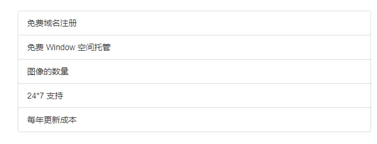
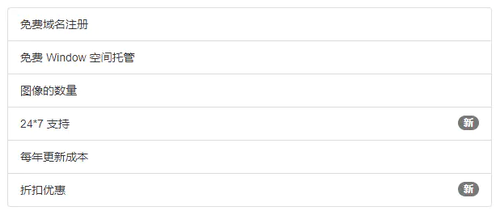
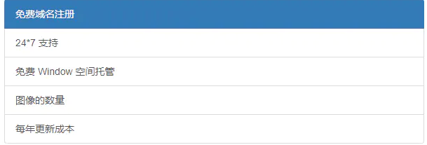
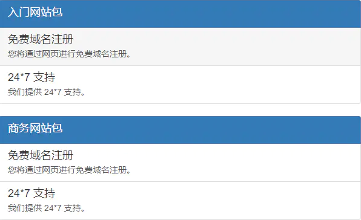

# bootstrap3 ##

内容组件，含对应的样式，与动画
## Bootstrap css
### 网格系统
#### 媒体查询 (有条件的CSS规则)
``` less
/* 超小设备（手机，小于 768px） */
/* Bootstrap 中默认情况下没有媒体查询 */

/* 小型设备（平板电脑，768px 起） */
@media (min-width: @screen-sm-min) { ... }

/* 中型设备（台式电脑，992px 起） */
@media (min-width: @screen-md-min) { ... }

/* 大型设备（大台式电脑，1200px 起） */
@media (min-width: @screen-lg-min) { ... }

```

#### 网格结构
> .col-xs-	.col-sm-	.col-md-	.col-lg-

##### 基本的网格结构
``` html
<div class="container">
   <div class="row">
      <div class="col-*-*"></div>
      <div class="col-*-*"></div>      
   </div>
   <div class="row">...</div>
</div>
<div class="container">....
```
##### 响应式的列重置(列重排) (小设备的正确显示 用到 clearfix visible-xs)
``` html
<div class="container">
    <div class="row" >
        <div class="col-xs-6 col-sm-3" 
            style="background-color: #dedef8;
            box-shadow: inset 1px -1px 1px #444, inset -1px 1px 1px #444;">
            <p>Lorem ipsum dolor sit amet, consectetur adipisicing elit.</p>
        </div>
        <div class="col-xs-6 col-sm-3" 
        style="background-color: #dedef8;box-shadow: 
        inset 1px -1px 1px #444, inset -1px 1px 1px #444;">
            <p>Lorem ipsum dolor sit amet, consectetur adipisicing elit, sed do 
            eiusmod tempor incididunt ut labore et dolore magna aliqua. Ut 
            enim ad minim veniam, quis nostrud exercitation ullamco laboris 
            nisi ut aliquip ex ea commodo consequat.
            </p>
            <p>Lorem ipsum dolor sit amet, consectetur adipisicing elit, sed do 
            eiusmod tempor incididunt ut. 
            </p>
        </div>
 
        <div class="clearfix visible-xs"></div>
 
        <div class="col-xs-6 col-sm-3" 
        style="background-color: #dedef8;
        box-shadow:inset 1px -1px 1px #444, inset -1px 1px 1px #444;">
            <p>Ut enim ad minim veniam, quis nostrud exercitation ullamco 
            laboris nisi ut aliquip ex ea commodo consequat. 
            </p>
        </div>
        <div class="col-xs-6 col-sm-3" 
        style="background-color: #dedef8;box-shadow: 
        inset 1px -1px 1px #444, inset -1px 1px 1px #444;">
            <p>Lorem ipsum dolor sit amet, consectetur adipisicing elit, sed do 
            eiusmod tempor incididunt ut labore et dolore magna aliqua. Ut 
            enim ad minim 
            </p>
        </div>
    </div>
</div>
```

##### 偏移列
``` html
<div class="container">
    <h1>Hello, world!</h1>
    <div class="row" >
        <div class="col-md-6 col-md-offset-3" 
        style="background-color: #dedef8;box-shadow: 
        inset 1px -1px 1px #444, inset -1px 1px 1px #444;">
            <p>Lorem ipsum dolor sit amet, consectetur adipisicing 
            elit.
            </p>
        </div>
    </div>
</div>
```
##### 嵌套列
``` html
<div class="container">
    <h1>Hello, world!</h1>
    <div class="row">
        <div class="col-md-3" style="background-color: #dedef8;box-shadow: inset 1px -1px 1px #444, inset -1px 1px 1px #444;">
            <h4>第一列</h4>
            <p>
                Lorem ipsum dolor sit amet, consectetur adipisicing elit.
            </p>
        </div>
        <div class="col-md-9" style="background-color: #dedef8;box-shadow: inset 1px -1px 1px #444, inset -1px 1px 1px #444;">
            <h4>第二列 - 分为四个盒子</h4>
            <div class="row">
                <div class="col-md-6" style="background-color: #B18904; box-shadow: inset 1px -1px 1px #444, inset -1px 1px 1px #444;">
                    <p>
                        Consectetur art party Tonx culpa semiotics. Pinterest 
        assumenda minim organic quis.
                    </p>
                </div>
                <div class="col-md-6" style="background-color: #B18904; box-shadow: inset 1px -1px 1px #444, inset -1px 1px 1px #444;">
                    <p>
                         sed do eiusmod tempor incididunt ut labore et dolore magna 
        aliqua. Ut enim ad minim veniam, quis nostrud exercitation 
        ullamco laboris nisi ut aliquip ex ea commodo consequat.
                    </p>
                </div>
            </div>
            <div class="row">
                <div class="col-md-6" style="background-color: #B18904; box-shadow: inset 1px -1px 1px #444, inset -1px 1px 1px #444;">
                    <p>
                        quis nostrud exercitation ullamco laboris nisi ut 
        aliquip ex ea commodo consequat.
                    </p>
                </div>
                <div class="col-md-6" style="background-color: #B18904; box-shadow: inset 1px -1px 1px #444, inset -1px 1px 1px #444;">
                    <p>
                        Lorem ipsum dolor sit amet, consectetur adipisicing elit, 
        sed do eiusmod tempor incididunt ut labore et dolore magna 
        aliqua. Ut enim ad minim.
                    </p>
                </div>
            </div>
        </div>
    </div>
</div>

```

##### 列排序 （以一种顺序编写列，然后以另一种顺序显示列)
``` html

<div class="container">
    <h1>Hello, world!</h1>
    <div class="row">
        <p>
            排序前
        </p>
        <div class="col-md-4" style="background-color: #dedef8; box-shadow: inset 1px -1px 1px #444, inset -1px 1px 1px #444;">
         我在左边
        </div>
        <div class="col-md-8" style="background-color: #dedef8; box-shadow: inset 1px -1px 1px #444, inset -1px 1px 1px #444;">
         我在右边
        </div>
    </div>
    <br>
    <div class="row">
        <p>
            排序后
        </p>
        <div class="col-md-4 col-md-push-8" style="background-color: #dedef8; box-shadow: inset 1px -1px 1px #444, inset -1px 1px 1px #444;">
         我在左边
        </div>
        <div class="col-md-8 col-md-pull-4" style="background-color: #dedef8; box-shadow: inset 1px -1px 1px #444, inset -1px 1px 1px #444;">
         我在右边
        </div>
    </div>
</div>

```

### 排版
#### 使段落突出显示 class="lead"
#### 强调
``` html
<small>本行内容是在标签内</small><br>
<strong>本行内容是在标签内</strong><br>
<em>本行内容是在标签内，并呈现为斜体</em><br>
<p class="text-left">向左对齐文本</p>
<p class="text-center">居中对齐文本</p>
<p class="text-right">向右对齐文本</p>
<p class="text-muted">本行内容是减弱的</p>
<p class="text-primary">本行内容带有一个 primary class</p>
<p class="text-success">本行内容带有一个 success class</p>
<p class="text-info">本行内容带有一个 info class</p>
<p class="text-warning">本行内容带有一个 warning class</p>
<p class="text-danger">本行内容带有一个 danger class</p>
```

#### 引用（Blockquote）
#### 列表
``` html
<h4>有序列表</h4>
<ol>
  <li>Item 1</li>
  <li>Item 2</li>
  <li>Item 3</li>
  <li>Item 4</li>
</ol>
<h4>无序列表</h4>
<ul>
  <li>Item 1</li>
  <li>Item 2</li>
  <li>Item 3</li>
  <li>Item 4</li>
</ul>
<h4>未定义样式列表</h4>
<ul class="list-unstyled">
  <li>Item 1</li>
  <li>Item 2</li>
  <li>Item 3</li>
  <li>Item 4</li>
</ul>
<h4>内联列表</h4>
<ul class="list-inline">
  <li>Item 1</li>
  <li>Item 2</li>
  <li>Item 3</li>
  <li>Item 4</li>
</ul>
<h4>定义列表</h4>
<dl>
  <dt>Description 1</dt>
  <dd>Item 1</dd>
  <dt>Description 2</dt>
  <dd>Item 2</dd>
</dl>
<h4>水平的定义列表</h4>
<dl class="dl-horizontal">
  <dt>Description 1</dt>
  <dd>Item 1</dd>
  <dt>Description 2</dt>
  <dd>Item 2</dd>
</dl>
```
#### 更多排版类

| 类                  | 描述                                        |
|---------------------+---------------------------------------------|
| .text-justify       | 设定文本对齐,段落中超出屏幕部分文字自动换行 |
| .text-nowrap        | 段落中超出屏幕部分不换行                    |
| .text-lowercase     | 设定文本小写                                |
| .text-uppercase     | 设定文本大写                                |
| .text-capitalize    | 设定单词首字母大写                          |
| .blockquote-reverse | 设定引用右对齐                              |

### 代码
``` html
<p><code>&lt;header&gt;</code> 作为内联元素被包围。</p>
<p>如果需要把代码显示为一个独立的块元素，请使用 &lt;pre&gt; 标签：</p>
<pre>
    &lt;article&gt;
        &lt;h1&gt;Article Heading&lt;/h1&gt;
    &lt;/article&gt;
</pre>

```
### 表格
#### 表格类
| 类                | 描述                                  |
|-------------------+---------------------------------------|
| .table            | 基本样式                              |
| .table-striped    | 在 <tbody> 内添加斑马线形式的条纹     |
| .table-bordered   | 为所有表格的单元格添加边框            |
| .table-hover      | 在 <tbody> 内的任一行启用鼠标悬停状态 |
| .table-condensed  | 让表格更加紧凑                        |
| .table-responsive | 响应式，小型设备有滚动条              |
|                   |                                       |
#### <tr>, <th> 和 <td> 类 (单元格类)

| 类       | 描述                             |
|----------+----------------------------------|
| .active  | 将悬停的颜色应用在行或者单元格上 |
| .success | 表示成功的操作                   |
| .info    | 表示信息变化的操作               |
| .warning | 表示一个警告的操作               |
| .danger  | 表示一个危险的操作               |

### 表单 ###
#### 垂直表单 (上下垂直)
``` html
<form role="form">
  <div class="form-group">
    <label for="name">名称</label>
    <input type="text" class="form-control" id="name" placeholder="请输入名称">
  </div>
  <div class="form-group">
    <label for="inputfile">文件输入</label>
    <input type="file" id="inputfile">
    <p class="help-block">这里是块级帮助文本的实例。</p>
  </div>
  <div class="checkbox">
    <label>
      <input type="checkbox">请打勾
    </label>
  </div>
  <button type="submit" class="btn btn-default">提交</button>
</form>
```
#### 内联表单 (左右一直线)
``` html
<form class="form-inline" role="form">
  <div class="form-group">
    <label class="sr-only" for="name">名称</label>
    <input type="text" class="form-control" id="name" placeholder="请输入名称">
  </div>
  <div class="form-group">
    <label class="sr-only" for="inputfile">文件输入</label>
    <input type="file" id="inputfile">
  </div>
  <div class="checkbox">
    <label>
      <input type="checkbox">请打勾
    </label>
  </div>
  <button type="submit" class="btn btn-default">提交</button>
</form>

```

#### 其它
- 多选 <select multiple class="form-control">
- 静态控件  <p class="form-control-static">email@example.com</p>
#### 控件状态
``` html
<form class="form-horizontal" role="form">
  <div class="form-group">
    <label class="col-sm-2 control-label">聚焦</label>
    <div class="col-sm-10">
      <input class="form-control" id="focusedInput" type="text" value="该输入框获得焦点...">
    </div>
  </div>
  <div class="form-group">
    <label for="inputPassword" class="col-sm-2 control-label">禁用</label>
    <div class="col-sm-10">
      <input class="form-control" id="disabledInput" type="text" placeholder="该输入框禁止输入..." disabled>
    </div>
  </div>
  <fieldset disabled>
    <div class="form-group">
      <label for="disabledTextInput" class="col-sm-2 control-label">禁用输入（Fieldset disabled）</label>
      <div class="col-sm-10">
        <input type="text" id="disabledTextInput" class="form-control" placeholder="禁止输入">
      </div>
    </div>
    <div class="form-group">
      <label for="disabledSelect" class="col-sm-2 control-label">禁用选择菜单（Fieldset disabled）</label>
      <div class="col-sm-10">
        <select id="disabledSelect" class="form-control">
          <option>禁止选择</option>
        </select>
      </div>
    </div>
  </fieldset>
  <div class="form-group has-success">
    <label class="col-sm-2 control-label" for="inputSuccess">输入成功</label>
    <div class="col-sm-10">
      <input type="text" class="form-control" id="inputSuccess">
    </div>
  </div>
  <div class="form-group has-warning">
    <label class="col-sm-2 control-label" for="inputWarning">输入警告</label>
    <div class="col-sm-10">
      <input type="text" class="form-control" id="inputWarning">
    </div>
  </div>
  <div class="form-group has-error">
    <label class="col-sm-2 control-label" for="inputError">输入错误</label>
    <div class="col-sm-10">
      <input type="text" class="form-control" id="inputError">
    </div>
  </div>
</form>

```
#### 表单帮助文本
``` html
<form role="form">
  <span>帮助文本实例</span>
  <input class="form-control" type="text" placeholder="">
  <span class="help-block">一个较长的帮助文本块，超过一行，
  需要扩展到下一行。本实例中的帮助文本总共有两行。</span>
</form>
```
### 按钮 
| 类           | 描述                                    |
| .btn         | 为按钮添加基本样式                      |
| .btn-default | 默认/标准按钮                           |
| .btn-primary | 原始按钮样式（未被操作）                |
| .btn-success | 表示成功的动作                          |
| .btn-info    | 该样式可用于要弹出信息的按钮            |
| .btn-warning | 表示需要谨慎操作的按钮                  |
| .btn-danger  | 表示一个危险动作的按钮操作              |
| .btn-link    | 让按钮看起来像个链接 (仍然保留按钮行为) |
| .btn-lg      | 制作一个大按钮                          |
| .btn-sm      | 制作一个小按钮                          |
| .btn-xs      | 制作一个超小按钮                        |
| .btn-block   | 块级按钮(拉伸至父元素100%的宽度)        |
| .active      | 按钮被点击                              |
| .disabled    | 禁用按钮                                |

#### 按钮大小 

| 类         | 描述                     |
| .btn-lg    | 这会让按钮看起来比较大。 |
| .btn-sm    | 这会让按钮看起来比较小。 |
| .btn-xs    | 这会让按钮看起来特别小。 |
| .btn-block | 占用整行                 |

#### 按钮状态  active(激活) disabled
#### 按钮组 btn-group  btn-group-lg  .btn-group-vertical (垂直) btn-group-justified (自适应大小)

内嵌下拉菜单的按钮组
``` html
<div class="btn-group">
  <button type="button" class="btn btn-primary">Apple</button>
  <button type="button" class="btn btn-primary">Samsung</button>
  <div class="btn-group">
    <button type="button" class="btn btn-primary dropdown-toggle" data-toggle="dropdown">
    Sony <span class="caret"></span></button>
    <ul class="dropdown-menu" role="menu">
      <li><a href="#">Tablet</a></li>
      <li><a href="#">Smartphone</a></li>
    </ul>
  </div>
</div>

```

分割按钮
``` html
<div class="btn-group">
  <button type="button" class="btn btn-primary">Sony</button>
  <button type="button" class="btn btn-primary dropdown-toggle" data-toggle="dropdown">
    <span class="caret"></span>
  </button>
  <ul class="dropdown-menu" role="menu">
    <li><a href="#">Tablet</a></li>
    <li><a href="#">Smartphone</a></li>
  </ul>
</div>
```
### 图片
| 类             | 描述                                          |
| ---            | ---                                           |
| .img-rounded   | 添加 border-radius:6px 来获得图片圆角。       |
| .img-circle    | 添加 border-radius:50% 来让整个图片变成圆形。 |
| .img-thumbnail | 添加一些内边距（padding）和一个灰色的边框。   |
|.img-responsive| 将 max-width: 100%; 和 height: auto; 样式应用在图片上

### 辅助类
#### 文本
#### 背景
| 类          | 描述                             |
| .bg-primary | 表格单元格使用了 "bg-primary" 类 |
| .bg-success | 表格单元格使用了 "bg-success" 类 |
| .bg-info    | 表格单元格使用了 "bg-info" 类    |
| .bg-warning | 表格单元格使用了 "bg-warning" 类 |
| .bg-danger  | 表格单元格使用了 "bg-danger" 类  |

#### 其它

| 类                    | 描述                                                             |
| .pull-left            | 元素浮动到左边                                                   |
| .pull-right           | 元素浮动到右边                                                   |
| .center-block         | 设置元素为 display:block 并居中显示                              |
| .clearfix	清除浮动 |                                                                  |
| .show                 | 强制元素显示                                                     |
| .hidden               | 强制元素隐藏                                                     |
| .sr-only              | 除了屏幕阅读器外，其他设备上隐藏元素                             |
| .sr-only-focusable    | 与 .sr-only 类结合使用，在元素获取焦点时显示(如：键盘操作的用户) |
| .text-hide            | 将页面元素所包含的文本内容替换为背景图                           |
| .close                | 显示关闭按钮                                                     |
| .caret                | 显示下拉式功能                                                   |

关闭图标
``` html
<p>关闭图标实例
  <button type="button" class="close" aria-hidden="true">
    &times;
  </button>
</p>
```

插入符
``` html
<p>插入符实例
  <span class="caret"></span>
</p>

```

清除浮动
``` html
<div class="clearfix"  style="background: #D8D8D8;border: 1px solid #000;padding: 10px;">
  <div class="pull-left" style="background:#58D3F7;">
    向左快速浮动
  </div>
  <div class="pull-right" style="background: #DA81F5;">
    向右快速浮动
  </div>
</div>
```


### 居中 ###

一、Bootstrap水平居中

1、 文本：class ="text-center"
2、 图片居中：class = "center-block"
3、其他元素：

 bootstrap3水平居中：利用bootstrap列偏移  class = "col-md-offset-4 col-lg-offset-4col-xl-offset-4"
 bootstrap4水平居中：class = "m-auto"
 

二、Bootstrap垂直居中

bootstrap3 如何让div内部垂直居中：

Bootstrap的栅格系统使用的是float：left的浮动方式，vertical-align属性不起作用，故把内部div的float属性清除，添加display属性，如下：

.middle {
float: none;
display: inline-block;
vertical-align: middle;
}

 

Bootstrap3登录框自适应水平居中+垂直居中

 
### 验证身份证和手机号 ###

``` hmtl
<!DOCTYPE html>
<html lang="en">

<head>
    <meta charset="utf-8">
    <meta name="viewport" content="width=device-width, initial-scale=1.0">
    <title>首页</title>
    <link rel="shortcut icon" href="img/favicon.ico">
    <link rel="apple-touch-icon" href="img/favicon.ico">
    <link href="https://cdn.bootcss.com/twitter-bootstrap/3.3.7/css/bootstrap.min.css" rel="stylesheet">
     <link href="http://cdn.bootcss.com/bootstrap-validator/0.5.3/css/bootstrapValidator.min.css" rel="stylesheet" />  

</head>

<body> 
    <form class="" autocomplete="off">
        <div class="form-group">
            <label>姓名</label>
            <input type="text" class="form-control" name="name" />
        </div>
        <div class="form-group">
            <label>身份证号</label>
            <input type="text" class="form-control" name="identity" />
        </div>
        <div class="form-group">
            <label>手机号</label>
            <input type="text" class="form-control" name="tel" />
        </div>
        <div class="form-group">
            <button type="button" id="submit" name="submit" class="btn btn-primary">提交</button>
            <button type="button" id="reset" name="reset" class="btn btn-primary">重置</button>
        </div>
    </form> 
 

    <script src="https://cdn.bootcss.com/jquery/3.3.1/jquery.min.js"></script>
    <script src="https://cdn.bootcss.com/twitter-bootstrap/3.3.7/js/bootstrap.min.js"></script>
    <script src="http://cdn.bootcss.com/bootstrap-validator/0.5.3/js/bootstrapValidator.min.js"></script> 
    <script>
        $('form').bootstrapValidator({
            message: 'This value is not valid',
            feedbackIcons: {
                valid: 'glyphicon glyphicon-ok',
                invalid: 'glyphicon glyphicon-remove',
                validating: 'glyphicon glyphicon-refresh'
            },
            fields: {
                name: {
                    message: '用户名验证失败',
                    validators: {
                        notEmpty: {
                            message: '用户名不能为空'
                        },
                        stringLength: {
                            min: 4,
                            message: '用户名长度必须大于4个字符'
                        },
                    }
                },
                identity: {
                    validators: {
                        notEmpty: {
                            message: '身份证号码不能为空'
                        },
                        callback: {
                            message: '身份证号码格式错误',
                            callback: function (value, validator) {
                                if (!value) {
                                    return true
                                } else if (isCardNo(value)) {
                                    return true;
                                } else {
                                    return false;
                                }
                            }
                        }
                    }
                },
                tel: {
                    validators: {
                        notEmpty: {
                            message: '手机号不能为空'
                        },
                        regexp: {
                            regexp: /^1\d{10}$/,
                            message: '手机号格式错误'
                        }
                    }
                }
            }
        });

        var bootstrapValidator = $('form').data('bootstrapValidator');

        // 提交时验证
        $('#submit').on('click', function () {
            bootstrapValidator.validate();
            if (bootstrapValidator.isValid()) {
                //表单提交的方法、比如ajax提交
                alert('success');
            }
        })

        // 重置表单
        $('#reset').on('click', function () {
            bootstrapValidator.resetForm();
            $('input').val('')
        }) 
        
        // 验证身份证号
        function isCardNo(card) {
            let reg = /(^\d{15}$)|(^\d{18}$)|(^\d{17}(\d|X|x)$)/;
            if (reg.test(card) === false) {
                return false
            } else {
                return true
            }
        }
        
        // 验证手机号
        function checkMobile(str) {
            let re = /^1\d{10}$/
            if (re.test(str)) {
                return true;
            } else {
                return false;
            }
        }

</script>

</body>

</html>

```

### float ###

.pull-right
.pull-left

注意，在导航条中，应该使用 .navbar-left或.navbar-right来对齐组件，而不是 .pull-left 或 .pull-right 。


### 列表 ###
#### ul.list-group/li.list-group-item ####

``` html
<ul class="list-group">
<li class="list-group-item">免费域名注册</li>
<li class="list-group-item">免费 Window 空间托管</li>
<li class="list-group-item">图像的数量</li>
<li class="list-group-item">24*7 支持</li>
<li class="list-group-item">每年更新成本</li>
</ul>
```




#### 列表加提醒 span.badge ####

``` html
<ul class="list-group">
<li class="list-group-item">免费域名注册</li>
<li class="list-group-item">免费 Window 空间托管</li>
<li class="list-group-item">图像的数量</li>
<li class="list-group-item">
<span class="badge">新</span>
24*7 支持
</li>
<li class="list-group-item">每年更新成本</li>
<li class="list-group-item">
<span class="badge">新</span>
折扣优惠
</li>
</ul>

```



#### 列表链接 ####

``` html
<a href="#" class="list-group-item active">
免费域名注册
</a>
<a href="#" class="list-group-item">24*7 支持</a>
<a href="#" class="list-group-item">免费 Window 空间托管</a>
<a href="#" class="list-group-item">图像的数量</a>
<a href="#" class="list-group-item">每年更新成本</a>
```




#### 链接下带参数说明 ####

``` html
<div class="list-group">
<a href="#" class="list-group-item active">
<h4 class="list-group-item-heading">
入门网站包
</h4>
</a>
<a href="#" class="list-group-item">
<h4 class="list-group-item-heading">
免费域名注册
</h4>
<p class="list-group-item-text">
您将通过网页进行免费域名注册。
</p>
</a>
<a href="#" class="list-group-item">
<h4 class="list-group-item-heading">
247 支持
</h4>
<p class="list-group-item-text">
我们提供 247 支持。
</p>
</a>
</div>
<div class="list-group">
<a href="#" class="list-group-item active">
<h4 class="list-group-item-heading">
商务网站包
</h4>
</a>
<a href="#" class="list-group-item">
<h4 class="list-group-item-heading">
免费域名注册
</h4>
<p class="list-group-item-text">
您将通过网页进行免费域名注册。
</p>
</a>
<a href="#" class="list-group-item">
<h4 class="list-group-item-heading">247 支持</h4>
<p class="list-group-item-text">我们提供 247 支持。</p>
</a>
</div>
```



#### 表格 ####

表格样式
- 1.基础样式.table
- 2.带背条纹表格.table-striped
- 3.带边框.table-bordered
- 4.悬停.table-hover
- 5.紧凑.table-condensed
- 6.行样式 .active .success .info

## Bootstrap 布局组件
### 字体图标(Glyphicons)
用法
```html
<span class="glyphicon glyphicon-search"></span>
```

> 定制尺寸 ,颜色   style="color: rgb(212, 106, 64);" 阴影  style="text-shadow: black 5px 3px 3px;"
``` html
<button type="button" class="btn btn-primary btn-lg" style="font-size: 60px">
  <span class="glyphicon glyphicon-user"></span> User
</button>
```

### 下拉菜单（Dropdowns）
``` html
<div class="dropdown">
    <button type="button" class="btn dropdown-toggle" id="dropdownMenu1" data-toggle="dropdown">主题
        <span class="caret"></span>
    </button>
    <ul class="dropdown-menu" role="menu" aria-labelledby="dropdownMenu1">
        <li role="presentation">
            <a role="menuitem" tabindex="-1" href="#">Java</a>
        </li>
        <li role="presentation">
            <a role="menuitem" tabindex="-1" href="#">数据挖掘</a>
        </li>
        <li role="presentation">
            <a role="menuitem" tabindex="-1" href="#">数据通信/网络</a>
        </li>
        <li role="presentation" class="divider"></li>
        <li role="presentation">
            <a role="menuitem" tabindex="-1" href="#">分离的链接</a>
        </li>
    </ul>
</div>

```

标题
``` html
<li role="presentation" class="dropdown-header">下拉菜单标题</li>
```

| 类                   | 描述                                        |
| .dropdown            | 指定下拉菜单，下拉菜单都包裹在 .dropdown 里 |
| .dropdown-menu       | 创建下拉菜单                                |
| .dropdown-menu-right | 下拉菜单右对齐                              |
| .dropdown-header     | 下拉菜单中添加标题                          |
| .dropup              | 指定向上弹出的下拉菜单                      |
| .disabled            | 下拉菜单中的禁用项                          |
| .divider             | 下拉菜单中的分割线                          |

### 标签
| 类                   | 描述                     |
| .label label-default | 默认的灰色标签           |
| .label label-primary | "primary" 类型的蓝色标签 |
| .label label-success | "success" 类型的绿色标签 |
| .label label-info    | "info" 类型的浅蓝色标签  |
| .label label-warning | "warning" 类型的黄色标签 |
| .label label-danger  | "danger" 类型的红色标签  |

### 警告（Alerts）

``` html
<div class="alert alert-success">成功！很好地完成了提交。</div>
<div class="alert alert-info">信息！请注意这个信息。</div>
<div class="alert alert-warning">警告！请不要提交。</div>
<div class="alert alert-danger">错误！请进行一些更改。</div>
```

可取消的警告（Dismissal Alerts）

``` html
<div class="alert alert-success alert-dismissable">
            <button type="button" class="close" data-dismiss="alert"
                    aria-hidden="true">
                &times;
            </button>
            成功！很好地完成了提交。
        </div>
        <div class="alert alert-info alert-dismissable">
            <button type="button" class="close" data-dismiss="alert"
                    aria-hidden="true">
                &times;
            </button>
            信息！请注意这个信息。
        </div>
        <div class="alert alert-warning alert-dismissable">
            <button type="button" class="close" data-dismiss="alert"
                    aria-hidden="true">
                &times;
            </button>
            警告！请不要提交。
        </div>
        <div class="alert alert-danger alert-dismissable">
            <button type="button" class="close" data-dismiss="alert"
                    aria-hidden="true">
                &times;
            </button>
            错误！请进行一些更改。
        </div>
```

警告链接
``` html
<div class="alert alert-success">
    <a href="#" class="alert-link">成功！很好地完成了提交。</a>
</div>
```

### 面板（Panels）

``` html
<div class="panel panel-primary">
    <div class="panel-heading">
        <h3 class="panel-title">面板标题</h3>
    </div>
    <div class="panel-body">
        这是一个基本的面板
    </div>
</div>
<div class="panel panel-success">
    <div class="panel-heading">
        <h3 class="panel-title">面板标题</h3>
    </div>
    <div class="panel-body">
        这是一个基本的面板
    </div>
</div>
<div class="panel panel-info">
    <div class="panel-heading">
        <h3 class="panel-title">面板标题</h3>
    </div>
    <div class="panel-body">
        这是一个基本的面板
    </div>
</div>
<div class="panel panel-warning">
    <div class="panel-heading">
        <h3 class="panel-title">面板标题</h3>
    </div>
    <div class="panel-body">
        这是一个基本的面板
    </div>
</div>
<div class="panel panel-danger">
    <div class="panel-heading">
        <h3 class="panel-title">面板标题</h3>
    </div>
    <div class="panel-body">
        这是一个基本的面板
    </div>
</div>
```

##  插件 (依赖jQuery)
### 插件概览

关闭插件
``` js
$(document).off('.data-api')
$(document).off('.alert.data-api')
```

使用 
``` js
// 初始化为默认行为
$("#myModal").modal()    
 // 初始化为不支持键盘               
$("#myModal").modal({ keyboard: false })  
// 初始化并立即调用 show
$("#myModal").modal('show')        
```

### 过渡效果（Transition）插件
### 模态框（Modal）插件
> 表单提交事件 可以用绑定 form  事件 ，这方法很笨!!
> ! 用 form.submit 事件好 ,这个方法好

``` html
<button type="submit" class="btn btn-primary tijiao" form="form1">提交更改</button>
```
#### 创建模态框
``` html
<h2>创建模态框（Modal）</h2>
<!-- 按钮触发模态框 -->
<button class="btn btn-primary btn-lg" data-toggle="modal" data-target="#myModal">静态打开 </button>
<!-- 模态框（Modal） -->
<div class="modal fade" id="myModal" tabindex="-1" role="dialog" aria-labelledby="myModalLabel" aria-hidden="true">
    <div class="modal-dialog">
        <div class="modal-content">
            <div class="modal-header">
                <button type="button" class="close" data-dismiss="modal" aria-hidden="true">&times;</button>
                <h4 class="modal-title" id="myModalLabel">模态框（Modal）标题</h4>
            </div>
            <div class="modal-body">在这里添加一些文本</div>
            <div class="modal-footer">
                <button type="button" class="btn btn-default" data-dismiss="modal">关闭</button>
                <button type="button" class="btn btn-primary">提交更改</button>
            </div>
        </div><!-- /.modal-content -->
    </div><!-- /.modal -->
</div>

```

代码讲解：

- 使用模态窗口，您需要有某种触发器。您可以使用按钮或链接。这里我们使用的是按钮。
- 如果您仔细查看上面的代码，您会发现在 <button> 标签中，data-target="#myModal" 是您想要在页面上加载的模态框的目标。您可以在页面上创建多个模态框，然后为每个模态框创建不同的触发器。现在，很明显，您不能在同一时间加载多个模块，但您可以在页面上创建多个在不同时间进行加载。
- 在模态框中需要注意两点：
   1. 第一是 .modal，用来把 <div> 的内容识别为模态框。
   2. 第二是 .fade class。当模态框被切换时，它会引起内容淡入淡出。
- aria-labelledby="myModalLabel"，该属性引用模态框的标题。
- 属性 aria-hidden="true" 用于保持模态窗口不可见，直到触发器被触发为止（比如点击在相关的按钮上）。
- <div class="modal-header">，modal-header 是为模态窗口的头部定义样式的类。
- class="close"，close 是一个 CSS class，用于为模态窗口的关闭按钮设置样式。
- data-dismiss="modal"，是一个自定义的 HTML5 data 属性。在这里它被用于关闭模态窗口。
- class="modal-body"，是 Bootstrap CSS 的一个 CSS class，用于为模态窗口的主体设置样式。
- class="modal-footer"，是 Bootstrap CSS 的一个 CSS class，用于为模态窗口的底部设置样式。
- data-toggle="modal"，HTML5 自定义的 data 属性 data-toggle 用于打开模态窗口。


#### 打开modal
##### 静态打开：通过data属性打开隐藏模态框

> 设置按钮button的data-toggle:"modal"（以模态框的形式打开），data-target:"#myModal"（设置为modal的id）

##### 动态打开：以jquery代码为例
``` js
$("#myModal").modal({
remote:"test/test.jsp";//可以填写一个url，会调用jquery load方法加载数据
backdrop:"static";//指定一个静态背景，当用户点击背景处，modal界面不会消失
keyboard:true;//当按下esc键时，modal框消失
})
 ```
remote处可以填写jsp路径或者html路径，用来给modal框注入内容

其它参数
``` js
//屏蔽键盘
$('#identifier').modal({
keyboard: false
})


//手动切换模态框。	
$('#identifier').modal('toggle')
//手动打开模态框。	
$('#identifier').modal('show')
//手动隐藏模态框。	
$('#identifier').modal('hide')
```


#### 动态打开事件
下表列出了模态框中要用到事件。这些事件可在函数中当钩子使用。

``` js

$("#myModal").on("loaded.bs.modal",function{
//在模态框加载的同时做一些动作
 
});
 
$("#myModal").on("show.bs.modal",function{
 
//在show方法后调用
 
});
 
 
$("#myModal").on("shown.bs.modal",function{
 
//在模态框完全展示出来做一些动作
 
});
 
$("#myModal").on("hide.bs.modal",function{
 
//hide方法后调用
 
});
 
$("#myModal").on("hiden.bs.modal",function{
 
//监听模态框隐藏事件做一些动作
 
});
```


### 弹出框（Popover）插件

``` html
<div class="container" style="padding: 100px 50px 10px;" >
    <button type="button" class="btn btn-default" title="Popover title"
            data-container="body" data-toggle="popover" data-placement="left"
            data-content="左侧的 Popover 中的一些内容">
        左侧的 Popover
    </button>
    <button type="button" class="btn btn-primary" title="Popover title"
            data-container="body" data-toggle="popover" data-placement="top"
            data-content="顶部的 Popover 中的一些内容">
        顶部的 Popover
    </button>
    <button type="button" class="btn btn-success" title="Popover title"
            data-container="body" data-toggle="popover" data-placement="bottom"
            data-content="底部的 Popover 中的一些内容">
        底部的 Popover
    </button>
    <button type="button" class="btn btn-warning" title="Popover title"
            data-container="body" data-toggle="popover" data-placement="right"
            data-content="右侧的 Popover 中的一些内容">
        右侧的 Popover
    </button>
</div>
 
<script>
$(function (){
    $("[data-toggle='popover']").popover();
});
</script>
</div>

```

### 折叠（Collapse）插件
``` html
<div class="panel-group" id="accordion">
    <div class="panel panel-default">
        <div class="panel-heading">
            <h4 class="panel-title">
                <a data-toggle="collapse" data-parent="#accordion" 
                href="#collapseOne">
                点击我进行展开，再次点击我进行折叠。第 1 部分--hide 方法
                </a>
            </h4>
        </div>
        <div id="collapseOne" class="panel-collapse collapse in">
            <div class="panel-body">
                Nihil anim keffiyeh helvetica, craft beer labore wes anderson cred 
                nesciunt sapiente ea proident. Ad vegan excepteur butcher vice 
                lomo.
            </div>
        </div>
    </div>
    <div class="panel panel-success">
        <div class="panel-heading">
            <h4 class="panel-title">
                <a data-toggle="collapse" data-parent="#accordion" 
                href="#collapseTwo">
                点击我进行展开，再次点击我进行折叠。第 2 部分--show 方法
                </a>
            </h4>
        </div>
        <div id="collapseTwo" class="panel-collapse collapse">
            <div class="panel-body">
                Nihil anim keffiyeh helvetica, craft beer labore wes anderson cred 
                nesciunt sapiente ea proident. Ad vegan excepteur butcher vice 
                lomo.
            </div>
        </div>
    </div>
    <div class="panel panel-info">
        <div class="panel-heading">
            <h4 class="panel-title">
                <a data-toggle="collapse" data-parent="#accordion" 
                href="#collapseThree">
                点击我进行展开，再次点击我进行折叠。第 3 部分--toggle 方法
                </a>
            </h4>
        </div>
        <div id="collapseThree" class="panel-collapse collapse">
            <div class="panel-body">
                Nihil anim keffiyeh helvetica, craft beer labore wes anderson cred 
                nesciunt sapiente ea proident. Ad vegan excepteur butcher vice 
                lomo.
            </div>
        </div>
    </div>
    <div class="panel panel-warning">
        <div class="panel-heading">
            <h4 class="panel-title">
                <a data-toggle="collapse" data-parent="#accordion" 
                href="#collapseFour">
                点击我进行展开，再次点击我进行折叠。第 4 部分--options 方法
                </a>
            </h4>
        </div>
        <div id="collapseFour" class="panel-collapse collapse">
            <div class="panel-body">
                Nihil anim keffiyeh helvetica, craft beer labore wes anderson cred 
                nesciunt sapiente ea proident. Ad vegan excepteur butcher vice 
                lomo.
            </div>
        </div>
    </div>
</div>
<script>
$(function () { $('#collapseFour').collapse({
        toggle: false
    })});
    $(function () { $('#collapseTwo').collapse('show')});
    $(function () { $('#collapseThree').collapse('toggle')});
    $(function () { $('#collapseOne').collapse('hide')});
</script>
```

### 轮播（Carousel）插件
#### 可选的标题
您可以通过 .item 内的 .carousel-caption 元素向幻灯片添加标题。只需要在该处放置任何可选的 HTML 即可，它会自动对齐并格式化

``` html
<div id="myCarousel" class="carousel slide">
    <!-- 轮播（Carousel）指标 -->
    <ol class="carousel-indicators">
        <li data-target="#myCarousel" data-slide-to="0" class="active"></li>
        <li data-target="#myCarousel" data-slide-to="1"></li>
        <li data-target="#myCarousel" data-slide-to="2"></li>
    </ol>   
    <!-- 轮播（Carousel）项目 -->
    <div class="carousel-inner">
        <div class="item active">
            
            <div class="carousel-caption">标题 1</div>
        </div>
        <div class="item">
            
            <div class="carousel-caption">标题 2</div>
        </div>
        <div class="item">
            
            <div class="carousel-caption">标题 3</div>
        </div>
    </div>
    <!-- 轮播（Carousel）导航 -->
    <a class="left carousel-control" href="#myCarousel" role="button" data-slide="prev">
        <span class="glyphicon glyphicon-chevron-left" aria-hidden="true"></span>
        <span class="sr-only">Previous</span>
    </a>
    <a class="right carousel-control" href="#myCarousel" role="button" data-slide="next">
        <span class="glyphicon glyphicon-chevron-right" aria-hidden="true"></span>
        <span class="sr-only">Next</span>
    </a>
</div>

```
#### 方法
``` js
$(function(){
        // 初始化轮播
        $(".start-slide").click(function(){
            $("#myCarousel").carousel('cycle');
        });
        // 停止轮播
        $(".pause-slide").click(function(){
            $("#myCarousel").carousel('pause');
        });
        // 循环轮播到上一个项目
        $(".prev-slide").click(function(){
            $("#myCarousel").carousel('prev');
        });
        // 循环轮播到下一个项目
        $(".next-slide").click(function(){
            $("#myCarousel").carousel('next');
        });
        // 循环轮播到某个特定的帧 
        $(".slide-one").click(function(){
            $("#myCarousel").carousel(0);
        });
        $(".slide-two").click(function(){
            $("#myCarousel").carousel(1);
        });
        $(".slide-three").click(function(){
            $("#myCarousel").carousel(2);
        });
    });

```

#### 事件
``` js

$('#identifier').on('slide.bs.carousel', function () {
//当调用 slide 实例方法时立即触发该事件。
})


$('#identifier').on('slid.bs.carousel', function () {
//当轮播完成幻灯片过渡效果时触发该事件。	
})
```

