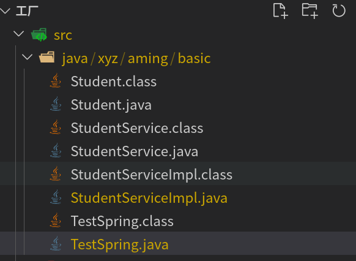
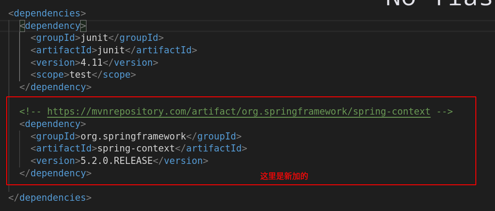

## java 编译



直接在文件目录执行编译，就不会报错

```
javac *.java
```

## java执行


进入包最外层的目录,执行指定的类，类中必须要有 **main**  函数 

```
java 包名.类名  
 ```

## Spring 依赖

在maven仓库中，搜索 Spring 关键词，选择 spring-context 依赖，拷贝到 pom.xml 文件的dependency 节点下面即可



## Spring 核心 API 
* ApplicationContext 

```
1. 作用: Spring 提供的ApplicationContext 这个工厂，用于对象的创建
2. 好处: 解耦合
```

    - ApplicationContext 接口类型

```
接口  : 屏蔽实现的差异
非Web环境 : ClassPathXmlApplicationContext
web环境 ： XmlWebApplicationContext
```

> 这两个实现对象占用大量内存，所以不会频繁创建，一个应用只会创建一个工厂对象。  
> 它们是线程安全的(做了锁的设置)

## 程序开发

```
1.创建类型
2.配置文件的配置 applicationContext.xml
3.通过工厂类，获得对象
ApplicationContext 

ApplicationContext ctx=new ClassPathXmlApplicationContext("/applicationContext.xml);
Person person=(Person)ctx.getBean("Person");

```
## 配置文件中需要注意的细节


## Spring 与日志框架的整合
> 好处：便于了解Spring 框架的运行过程，便于程序的调试

* 如何整合
1. Spring1.2.3 早期的版本都是与 commons-logging.jar 整合
2. Spring5.x 默认整合的日志框架是 logback log4j2  (整合好了)

* 实际 整合 log4j (log4j 与 log4j2 差别很大)
1. 引入 log4j jar包
2. 引入 log4.properties 配置文件

* pom

```
<dependency>
  <groupId>org.slf4j</groupId>
  <artifactId>slf4j-log4j12</artifactId>
  <version>1.7.21</version>
</dependency>
<dependency>
  <groupId>log4j</groupId>
  <artifactId>log4j</artifactId>
  <version>1.2.17</version>
</dependency>
```

* 引⼊ log4j.properties 配置⽂件；

```
# resources文件夹根目录下
### 配置根

log4j.rootLogger = debug,console
### 日志输出到控制台显示
log4j.appender.console=org.apache.log4j.ConsoleAppender
log4j.appender.console.Target=System.out
log4j.appender.console.layout=org.apache.log4j.PatternLayout
log4j.appender.console.layout.ConversionPattern=%d{yyyy-MM-dd HH:mm:ss} %-5p %c{1}:%L - %m%n
```

## 注入
1. 什么是注入
> 通过Spring 工厂及配置文件，为所创建对象的成员变量赋值

1.1 为什么需要注入
通过编码的方式，为成员变量进行赋值，存在耦合


1.2 如何进行注入 [开发步骤]

```
类的成员变量提供 set get 方法  
配置 spring 的配置文件
```


1.3 注入的好处
> 解耦合 (代码的类和实现分离)

1.4 set 注入详解


* JDK 内置类型

数组
```
 <property name="emails">
    <list>
        <value>abc@qq.com</value>
        <value>123@qq.com</value>
        <value>hello@qq.com</value>
    </list>
</property>
```

Set集合
```
<property name="tels">
	<set>
		<value>138xxxxxxxxxx</value>
		<value>139xxxxxxxxxx</value>
		<value>138xxxxxxxxxx</value><!--set会自动去重-->
	</set>
</property>

```

List集合
```
<property name="addresses">
	<list>
		<value>China</value>
		<value>Earth</value>
		<value>hell</value>
	</list>
</property>
```

Map集合
```
<property name="qqs">
    <map>
        <entry>
            <key><value>hello</value></key>
            <value>12312312312</value>
        </entry>
        <entry>
            <key><value>world</value></key>
            <value>21314214214</value>
        </entry>
    </map>
</property>
```

Properites
> 特殊的Map 类型

```
<property name="p">
    <props>
        <prop key="key1">value1</prop>
        <prop key="key2">value2</prop>
        <prop key="key3">value3</prop>
    </props>
</property>
```

* 复杂的 JDK 类型 (自定义)
> 需要程序员自定义类型转换器，处理

1. 用户自定义类型
  1.1 第一种方式
  * 为成员变量提供 set get 方法
  * 配置文件中进行注入 (赋值)


> 用接口类型，与实现分离


1.2 第二种方式
* 第一种方式存在的问题  
 配置⽂件代码冗余；  
 被注入的对象 （UserDAO）多次创建，浪费（JVM)内存资源。

[开发步骤]：

为成员变量提供 set get ⽅法；  
配置⽂件中进⾏配置；
```
<bean id="userDAO" class="com.yusael.dao.UserDAOImpl"></bean>

<bean id="userService" class="com.yusael.service.UserServiceImpl">
    <property name="userDAO">
        <ref bean="userDAO"/>
    </property>
</bean>
```
Spring4.x 废除了 <ref local=""/> 基本等效 <ref bean=""/>；
