# bootstrap3
Bootstrap 是一个用于快速开发 Web 应用程序和网站的前端框架

Bootstrap 包的内容

1)基本结构：Bootstrap 提供了一个带有网格系统、链接样式、背景的基本结构
2)CSS：Bootstrap 自带以下特性：全局的 CSS 设置、定义基本的 HTML 元素样式、可扩展的 class，以及一个先进的网格系统
3)组件：Bootstrap 包含了十几个可重用的组件，用于创建图像、下拉菜单、导航、警告框、弹出框等等
4)JavaScript 插件：Bootstrap 包含了十几个自定义的 jQuery 插件。您可以直接包含所有的插件，也可以逐个包含这些插件
5)定制：您可以定制 Bootstrap 的组件、LESS 变量和 jQuery 插件来得到您自己的版本。


## 表单

### 输入框 ###

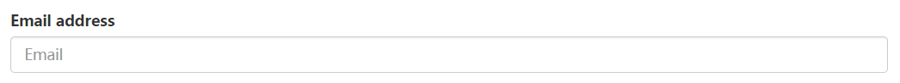

``` html
<form>
    //如果使用内联表单，则在 form 标签中加入 form-inline 类
    <div class="form-group">
        <label></label>
        <input class="form-control">
	</div>
</form>
```

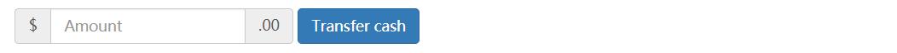

``` html
<div class="form-group">
    <label class="sr-only"></label>
    <div class="input-group">
        <div class="input-group-addon">$</div>
        <input class="form-control">
        <div class="input-group-addon">.00</div>
    </div>
</div>

```

水平排列表单(栅格化)

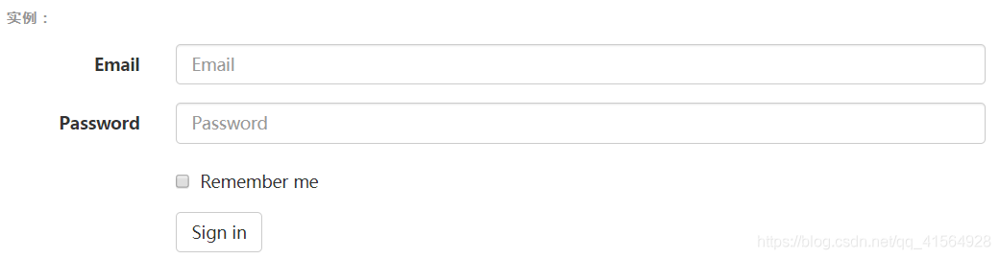

``` html
<form class="form-horizontal">
    //相当于 row 类名
  <div class="form-group">
    <label for="inputEmail3" class="col-sm-2 control-label">Email</label>
    <div class="col-sm-10">
      <input type="email" class="form-control" id="inputEmail3" placeholder="Email">
    </div>
  </div>
</form>


```
静态控件

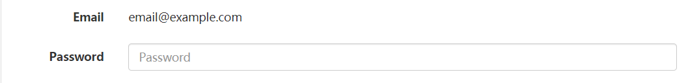

``` html
<form class="form-horizontal">
  <div class="form-group">
    <label class="col-sm-2 control-label">Email</label>
    <div class="col-sm-10">
      <p class="form-control-static">email@example.com</p>
    </div>
  </div>
  <div class="form-group">
    <label for="inputPassword" class="col-sm-2 control-label">Password</label>
    <div class="col-sm-10">
      <input type="password" class="form-control" id="inputPassword">
    </div>
  </div>
</form>

```
校验控件

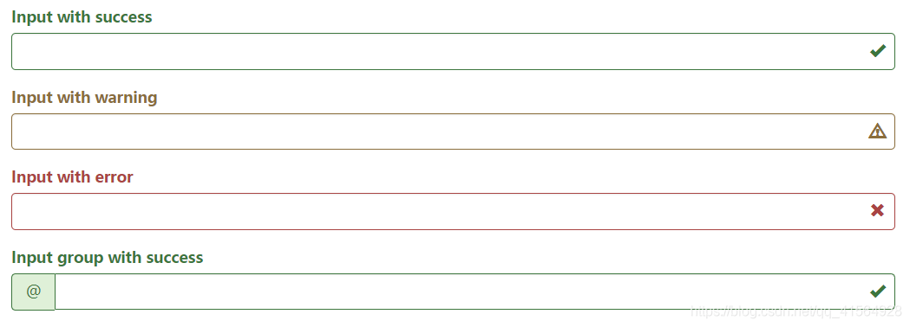

``` html
<div class="form-group has-success has-feedback">
  <label class="control-label" for="inputSuccess2">Input with success</label>
  <input type="text" class="form-control" id="inputSuccess2" aria-describedby="inputSuccess2Status">
  <span class="glyphicon glyphicon-ok form-control-feedback" aria-hidden="true"></span>
  <span id="inputSuccess2Status" class="sr-only">(success)</span>
</div>
<div class="form-group has-warning has-feedback">
  <label class="control-label" for="inputWarning2">Input with warning</label>
  <input type="text" class="form-control" id="inputWarning2" aria-describedby="inputWarning2Status">
  <span class="glyphicon glyphicon-warning-sign form-control-feedback" aria-hidden="true"></span>
  <span id="inputWarning2Status" class="sr-only">(warning)</span>
</div>
<div class="form-group has-error has-feedback">
  <label class="control-label" for="inputError2">Input with error</label>
  <input type="text" class="form-control" id="inputError2" aria-describedby="inputError2Status">
  <span class="glyphicon glyphicon-remove form-control-feedback" aria-hidden="true"></span>
  <span id="inputError2Status" class="sr-only">(error)</span>
</div>
<div class="form-group has-success has-feedback">
  <label class="control-label" for="inputGroupSuccess1">Input group with success</label>
  <div class="input-group">
    <span class="input-group-addon">@</span>
    <input type="text" class="form-control" id="inputGroupSuccess1" aria-describedby="inputGroupSuccess1Status">
  </div>
  <span class="glyphicon glyphicon-ok form-control-feedback" aria-hidden="true"></span>
  <span id="inputGroupSuccess1Status" class="sr-only">(success)</span>
</div>

```

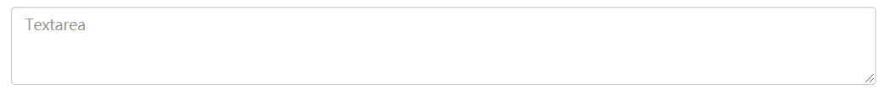
``` html
<textarea class="form-control"></textarea>

```

复选框 & 单选框


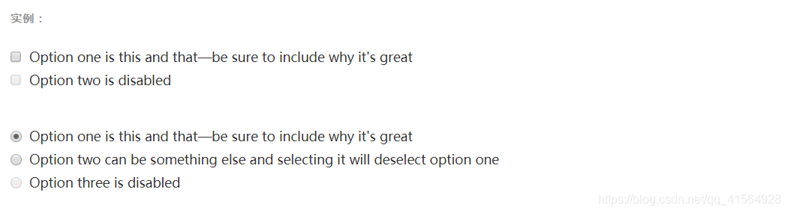

``` html
<div class="checkbox">
  <label>
    <input type="checkbox" value="">
    Option one is this and that&mdash;be sure to include why it's great
  </label>
</div>
<div class="checkbox disabled">
  <label>
    <input type="checkbox" value="" disabled>
    Option two is disabled
  </label>
</div>
<div class="radio">
  <label>
    <input type="radio" name="optionsRadios" id="optionsRadios2" value="option2">
    Option two can be something else and selecting it will deselect option one
  </label>
</div>
<div class="radio disabled">
  <label>
    <input type="radio" name="optionsRadios" id="optionsRadios3" value="option3" disabled>
    Option three is disabled
  </label>
</div>

```


按钮

``` html
<button type="button" class="btn btn-default">（默认样式）Default</button>
<button type="button" class="btn btn-primary">（首选项）Primary</button>
<button type="button" class="btn btn-success">（成功）Success</button>
<button type="button" class="btn btn-info">（一般信息）Info</button>
<button type="button" class="btn btn-warning">（警告）Warning</button>
<button type="button" class="btn btn-danger">（危险）Danger</button>
<button type="button" class="btn btn-link">（链接）Link</button>

```
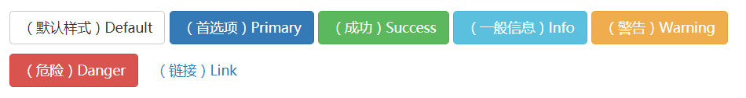
按钮尺寸

``` html
<button class="btn btn-lg">大按钮</button>
<button class="btn btn-sm">小按钮</button>
<button class="btn btn-ms">超小按钮</button>

```
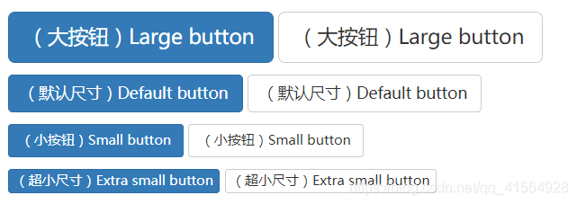
块级按钮

``` html
<button class="btn btn-block">块级按钮</button>
将把按钮的宽度拉伸到 父级元素的100% 
```

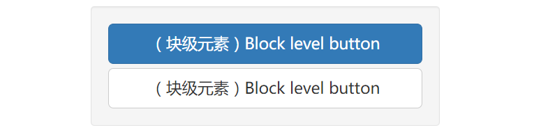
禁用按钮

``` html
<button class="btn btn-primary" disabled="disabled">禁用按钮</button>
如果是使用a链接创建的按钮
<a class="btn btn-primary disabled"></a>
直接在a的class中加入disabled类即可

```
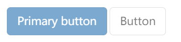
2. 图片

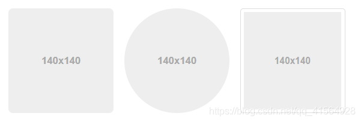

``` html


```
3. 文本

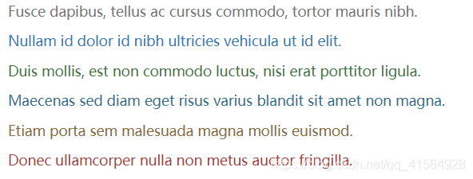

``` html
<p class="text-muted">...</p>
<p class="text-primary">...</p>
<p class="text-success">...</p>
<p class="text-info">...</p>
<p class="text-warning">...</p>
<p class="text-danger">...</p>

```
4. 颜色


``` html
@brand-primary: darken(#428bca, 6.5%); // #337ab7
@brand-success: #5cb85c;
@brand-info:    #5bc0de;
@brand-warning: #f0ad4e;
@brand-danger:  #d9534f;

```
5. alert 警告框

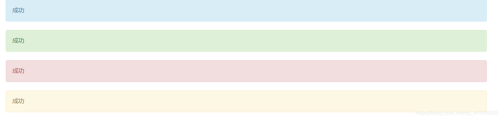

``` html
<div class="container">
    <div class="alert alert-info">成功</div>
    <div class="alert alert-success">成功</div>
    <div class="alert alert-danger">成功</div>
    <div class="alert alert-warning">成功<a class="alert-link">点击这里</a></div>
    使用alert-link类可以为文本加上链接效果
</div>

```
6.下拉菜单框

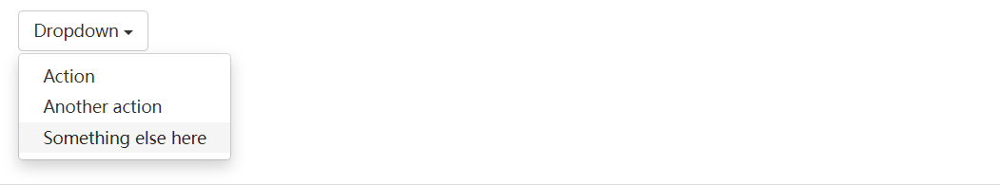
``` html
<div class="dropdown">
  <button class="btn btn-default dropdown-toggle" type="button" id="dropdownMenu1" data-toggle="dropdown" aria-haspopup="true" aria-expanded="true">
    Dropdown
    <span class="caret"></span>
  </button>
  <ul class="dropdown-menu" aria-labelledby="dropdownMenu1">
    <li><a href="#">Action</a></li>
    <li><a href="#">Another action</a></li>
    <li><a href="#">Something else here</a></li>
    <li role="separator" class="divider"></li>
    <li><a href="#">Separated link</a></li>
  </ul>
</div>

```
7. btn-group 按钮组

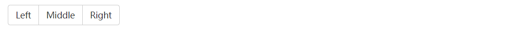
``` html
<div class="btn-group" role="group">
    //如果是要垂直的按钮组，则把 btn-group 改成 btn-group-vertical
  <button type="button" class="btn btn-default">Left</button>
  <button type="button" class="btn btn-default">Middle</button>
  <button type="button" class="btn btn-default">Right</button>
</div>

```
8. 按钮组下拉框

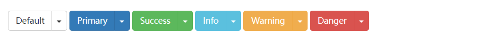
``` html
<div class="btn-group">
  <button type="button" class="btn btn-danger">Action</button>
  <button type="button" class="btn btn-danger dropdown-toggle" data-toggle="dropdown" aria-haspopup="true" aria-expanded="false">
    <span class="caret"></span>
    <span class="sr-only">Toggle Dropdown</span>
  </button>
  <ul class="dropdown-menu">
    <li><a href="#">Action</a></li>
    <li><a href="#">Another action</a></li>
    <li><a href="#">Something else here</a></li>
    <li role="separator" class="divider"></li>
    <li><a href="#">Separated link</a></li>
  </ul>
</div>

```
9. nav Tab页

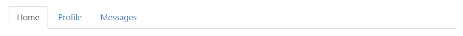
``` html
<ul class="nav nav-tabs">
<li class="active"><a href="#moodTab" data-toggle="tab">发现</a></li>
<li><a href="#diaryTab" data-toggle="tab">日志</a></li>
</ul>                                       
<div class="tab-content">
    <div class="tab-pane fade in active" id="moodTab" ></div>
</div>

```

``` html
<ul class="nav nav-pills">
<li class="active"><a href="#moodTab" data-toggle="tab">发现</a></li>
<li><a href="#diaryTab" data-toggle="tab">日志</a></li>
</ul>                                       
<div class="tab-content">
    <div class="tab-pane fade in active" id="moodTab" ></div>
</div>

```


``` html 
<ul class="nav nav-pills nav-stacked">
<li class="active"><a href="#moodTab" data-toggle="tab">发现</a></li>
<li><a href="#diaryTab" data-toggle="tab">日志</a></li>
</ul>                                       
<div class="tab-content">
    <div class="tab-pane fade in active" id="moodTab" ></div>
</div>

```
10. navbar 导航条

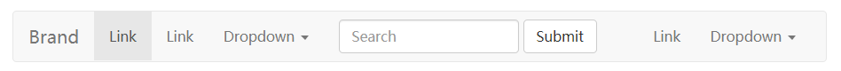
``` html
<nav class="navbar navbar-default">
  <div class="container-fluid">
    <!-- Brand and toggle get grouped for better mobile display -->
    <div class="navbar-header">
      <button type="button" class="navbar-toggle collapsed" data-toggle="collapse" data-target="#bs-example-navbar-collapse-1" aria-expanded="false">
        <span class="sr-only">Toggle navigation</span>
        <span class="icon-bar"></span>
        <span class="icon-bar"></span>
        <span class="icon-bar"></span>
      </button>
      <a class="navbar-brand" href="#">Brand</a>
    </div>

    <!-- Collect the nav links, forms, and other content for toggling -->
    <div class="collapse navbar-collapse" id="bs-example-navbar-collapse-1">
      <ul class="nav navbar-nav">
        <li class="active"><a href="#">Link <span class="sr-only">(current)</span></a></li>
        <li><a href="#">Link</a></li>
        <li class="dropdown">
          <a href="#" class="dropdown-toggle" data-toggle="dropdown" role="button" aria-haspopup="true" aria-expanded="false">Dropdown <span class="caret"></span></a>
          <ul class="dropdown-menu">
            <li><a href="#">Action</a></li>
            <li><a href="#">Another action</a></li>
            <li><a href="#">Something else here</a></li>
            <li role="separator" class="divider"></li>
            <li><a href="#">Separated link</a></li>
            <li role="separator" class="divider"></li>
            <li><a href="#">One more separated link</a></li>
          </ul>
        </li>
      </ul>
      <form class="navbar-form navbar-left">
        <div class="form-group">
          <input type="text" class="form-control" placeholder="Search">
        </div>
        <button type="submit" class="btn btn-default">Submit</button>
      </form>
      <ul class="nav navbar-nav navbar-right">
        <li><a href="#">Link</a></li>
        <li class="dropdown">
          <a href="#" class="dropdown-toggle" data-toggle="dropdown" role="button" aria-haspopup="true" aria-expanded="false">Dropdown <span class="caret"></span></a>
          <ul class="dropdown-menu">
            <li><a href="#">Action</a></li>
            <li><a href="#">Another action</a></li>
            <li><a href="#">Something else here</a></li>
            <li role="separator" class="divider"></li>
            <li><a href="#">Separated link</a></li>
          </ul>
        </li>
      </ul>
    </div><!-- /.navbar-collapse -->
  </div><!-- /.container-fluid -->
</nav>

```
11. breadcrumb 面包屑

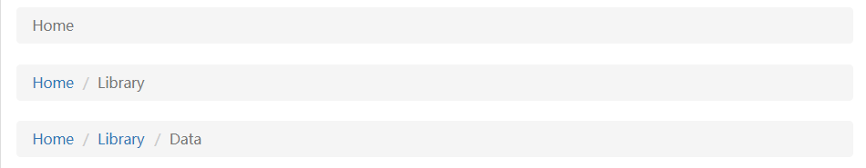
``` html
<ol class="breadcrumb">
    <li><a href="#">Home</a></li>
</ol>

```
12. 分页

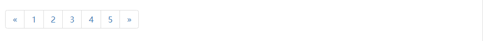

``` html
<nav aria-label="Page navigation">
  <ul class="pagination">
    <li>
      <a href="#" aria-label="Previous">
        <span aria-hidden="true">&laquo;</span>
      </a>
    </li>
    <li><a href="#">1</a></li>
    <li><a href="#">2</a></li>
    <li><a href="#">3</a></li>
    <li><a href="#">4</a></li>
    <li><a href="#">5</a></li>
    <li>
      <a href="#" aria-label="Next">
        <span aria-hidden="true">&raquo;</span>
      </a>
    </li>
  </ul>
</nav>

```

13. label 标签

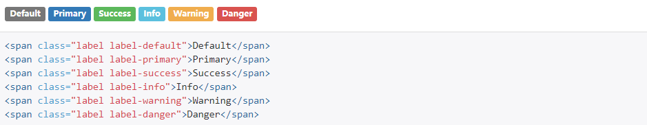
14. badge 徽章


``` html
<button class="btn btn-primary" type="button">
  Messages <span class="badge">4</span>
</button>

```
15. progress 进度条

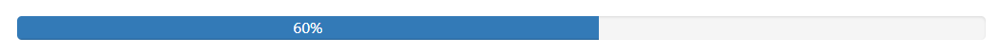
``` html
<div class="progress">
  <div class="progress-bar" role="progressbar" aria-valuenow="60" aria-valuemin="0" aria-valuemax="100" style="width: 60%;">
    60%
  </div>
</div>
通过更改progress-bar的style的width来调整进度

```
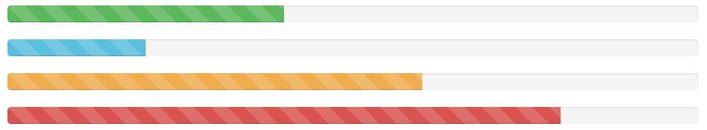
``` html
<div class="progress">
  <div class="progress-bar progress-bar-success progress-bar-striped" role="progressbar" aria-valuenow="40" aria-valuemin="0" aria-valuemax="100" style="width: 40%">
    <span class="sr-only">40% Complete (success)</span>
  </div>
</div>
<div class="progress">
  <div class="progress-bar progress-bar-info progress-bar-striped" role="progressbar" aria-valuenow="20" aria-valuemin="0" aria-valuemax="100" style="width: 20%">
    <span class="sr-only">20% Complete</span>
  </div>
</div>
<div class="progress">
  <div class="progress-bar progress-bar-warning progress-bar-striped" role="progressbar" aria-valuenow="60" aria-valuemin="0" aria-valuemax="100" style="width: 60%">
    <span class="sr-only">60% Complete (warning)</span>
  </div>
</div>
<div class="progress">
  <div class="progress-bar progress-bar-danger progress-bar-striped" role="progressbar" aria-valuenow="80" aria-valuemin="0" aria-valuemax="100" style="width: 80%">
    <span class="sr-only">80% Complete (danger)</span>
  </div>
</div>

```
16. list-group 列表组

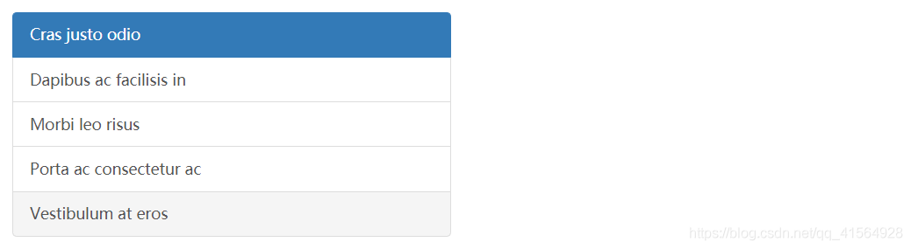
``` html
<div class="list-group">
  <a href="#" class="list-group-item active">
    Cras justo odio
  </a>
  <a href="#" class="list-group-item">Dapibus ac facilisis in</a>
  <a href="#" class="list-group-item">Morbi leo risus</a>
  <a href="#" class="list-group-item">Porta ac consectetur ac</a>
  <a href="#" class="list-group-item">Vestibulum at eros</a>
    除了使用a标签，还可以使用button
</div>

```
17. panel 面板

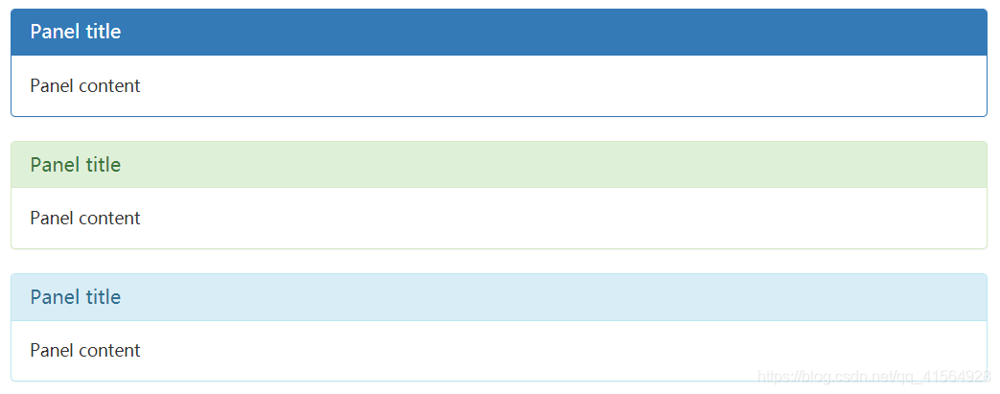
``` html
<div class="panel panel-primary">
	<div class="panel-heading"></div>
	<div class="panel-body"></div>
	<div class="panel-footer"></div>
</div>
```

## 居中
一、Bootstrap水平居中

1、 文本：class ="text-center"
2、 图片居中：class = "center-block"
3、其他元素：

 bootstrap3水平居中：利用bootstrap列偏移  class = "col-md-offset-4 col-lg-offset-4col-xl-offset-4"
 bootstrap4水平居中：class = "m-auto"
 

二、Bootstrap垂直居中

bootstrap3 如何让div内部垂直居中：

Bootstrap的栅格系统使用的是float：left的浮动方式，vertical-align属性不起作用，故把内部div的float属性清除，添加display属性，如下：

.middle {
float: none;
display: inline-block;
vertical-align: middle;
}

 

Bootstrap3登录框自适应水平居中+垂直居中

 
## 验证身份证和手机号
``` hmtl
<!DOCTYPE html>
<html lang="en">

<head>
    <meta charset="utf-8">
    <meta name="viewport" content="width=device-width, initial-scale=1.0">
    <title>首页</title>
    <link rel="shortcut icon" href="img/favicon.ico">
    <link rel="apple-touch-icon" href="img/favicon.ico">
    <link href="https://cdn.bootcss.com/twitter-bootstrap/3.3.7/css/bootstrap.min.css" rel="stylesheet">
     <link href="http://cdn.bootcss.com/bootstrap-validator/0.5.3/css/bootstrapValidator.min.css" rel="stylesheet" />  

</head>

<body> 
    <form class="" autocomplete="off">
        <div class="form-group">
            <label>姓名</label>
            <input type="text" class="form-control" name="name" />
        </div>
        <div class="form-group">
            <label>身份证号</label>
            <input type="text" class="form-control" name="identity" />
        </div>
        <div class="form-group">
            <label>手机号</label>
            <input type="text" class="form-control" name="tel" />
        </div>
        <div class="form-group">
            <button type="button" id="submit" name="submit" class="btn btn-primary">提交</button>
            <button type="button" id="reset" name="reset" class="btn btn-primary">重置</button>
        </div>
    </form> 
 

    <script src="https://cdn.bootcss.com/jquery/3.3.1/jquery.min.js"></script>
    <script src="https://cdn.bootcss.com/twitter-bootstrap/3.3.7/js/bootstrap.min.js"></script>
    <script src="http://cdn.bootcss.com/bootstrap-validator/0.5.3/js/bootstrapValidator.min.js"></script> 
    <script>
        $('form').bootstrapValidator({
            message: 'This value is not valid',
            feedbackIcons: {
                valid: 'glyphicon glyphicon-ok',
                invalid: 'glyphicon glyphicon-remove',
                validating: 'glyphicon glyphicon-refresh'
            },
            fields: {
                name: {
                    message: '用户名验证失败',
                    validators: {
                        notEmpty: {
                            message: '用户名不能为空'
                        },
                        stringLength: {
                            min: 4,
                            message: '用户名长度必须大于4个字符'
                        },
                    }
                },
                identity: {
                    validators: {
                        notEmpty: {
                            message: '身份证号码不能为空'
                        },
                        callback: {
                            message: '身份证号码格式错误',
                            callback: function (value, validator) {
                                if (!value) {
                                    return true
                                } else if (isCardNo(value)) {
                                    return true;
                                } else {
                                    return false;
                                }
                            }
                        }
                    }
                },
                tel: {
                    validators: {
                        notEmpty: {
                            message: '手机号不能为空'
                        },
                        regexp: {
                            regexp: /^1\d{10}$/,
                            message: '手机号格式错误'
                        }
                    }
                }
            }
        });

        var bootstrapValidator = $('form').data('bootstrapValidator');

        // 提交时验证
        $('#submit').on('click', function () {
            bootstrapValidator.validate();
            if (bootstrapValidator.isValid()) {
                //表单提交的方法、比如ajax提交
                alert('success');
            }
        })

        // 重置表单
        $('#reset').on('click', function () {
            bootstrapValidator.resetForm();
            $('input').val('')
        }) 
        
        // 验证身份证号
        function isCardNo(card) {
            let reg = /(^\d{15}$)|(^\d{18}$)|(^\d{17}(\d|X|x)$)/;
            if (reg.test(card) === false) {
                return false
            } else {
                return true
            }
        }
        
        // 验证手机号
        function checkMobile(str) {
            let re = /^1\d{10}$/
            if (re.test(str)) {
                return true;
            } else {
                return false;
            }
        }

</script>

</body>

</html>

```
