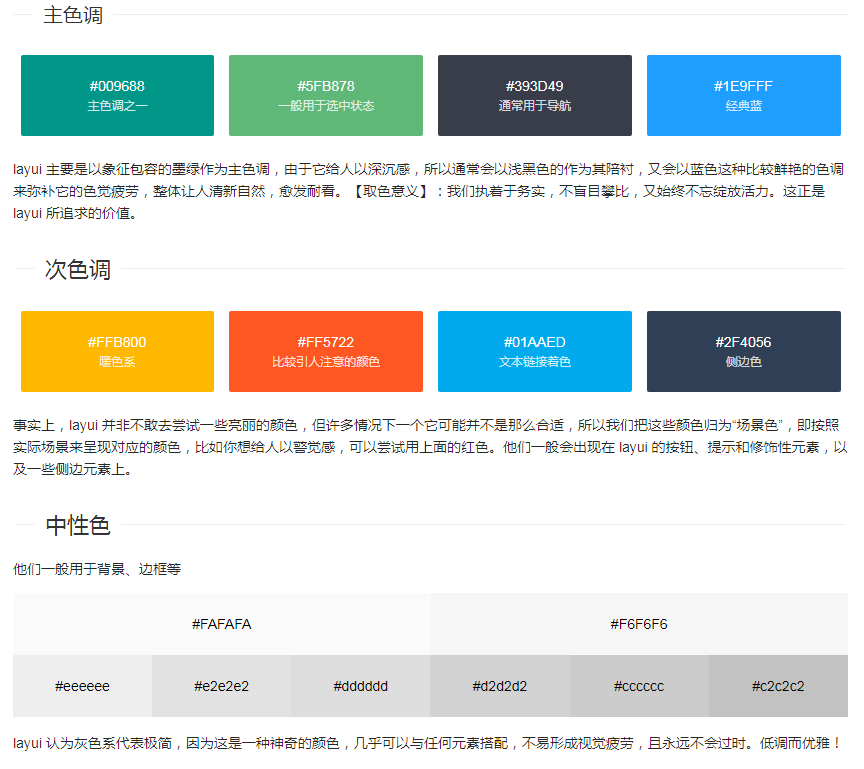

# layui 界面组件
## 安装  
   下载 https://www.layui.com/

   引入
  ``` html
     <link rel="stylesheet" href="./static/css/layui.css" media="all">
     <script src="./static/layui.js" charset="utf-8"></script>
```


``` html
     <!-- 引入 layui.css -->
     <link rel="stylesheet" href="//unpkg.com/layui@2.6.8/dist/css/layui.css">
     <!-- 引入 layui.js -->
       <script src="//unpkg.com/layui@2.6.8/dist/layui.js"></script>
 ``` 

   
   使用
   ``` html
         <script>
            //一般直接写在一个js文件中
            layui.use(['layer', 'form'], function(){
            var layer = layui.layer
            ,form = layui.form;

            layer.msg('Hello World');
            });
          </script> 
```
##  页面元素
### 栅格系统
栅格布局规则：

 1. xs（超小屏幕，如手机）、sm（小屏幕，如平板）、md（桌面中等屏幕 990px）、lg（桌面大型屏幕）
 2. layui-col-space5 (列间距，单位 px)、 layui-col-md-offset3 ( 列偏移 )
      
         移动设备、平板、桌面端的不同表现：
   ```  html
         <div class="layui-row">
           <div class="layui-col-xs6 layui-col-sm6 layui-col-md4">
             移动：6/12 | 平板：6/12 | 桌面：4/12
           </div>
           <div class="layui-col-xs6 layui-col-sm6 layui-col-md4">
             移动：6/12 | 平板：6/12 | 桌面：4/12
           </div>
           <div class="layui-col-xs4 layui-col-sm12 layui-col-md4">
             移动：4/12 | 平板：12/12 | 桌面：4/12
           </div>
           <div class="layui-col-xs4 layui-col-sm7 layui-col-md8">
             移动：4/12 | 平板：7/12 | 桌面：8/12
           </div>
           <div class="layui-col-xs4 layui-col-sm5 layui-col-md4">
             移动：4/12 | 平板：5/12 | 桌面：4/12
           </div>
         </div>
       </div>
```
          
 响应式公共类：
    | 类名（class）             | 说明                                                        |
    | layui-show-*-block        | 定义不同设备下的 display: block; * 可选值有：xs、sm、md、lg |
    | layui-show-*-inline       | 定义不同设备下的 display: inline; * 可选值同上              |
    | layui-show-*-inline-block | 定义不同设备下的 display: inline-block; * 可选值同上        |
    | layui-hide-*              | 定义不同设备下的隐藏类，即： display: none; * 可选值同上    |
### 颜色设计 https://www.layui.com/doc/element/color.html
    
    
   - 赤色：class="layui-bg-red"
   - 橙色：class="layui-bg-orange"
   - 墨绿：class="layui-bg-green"
   - 藏青：class="layui-bg-cyan"
   - 蓝色：class="layui-bg-blue"
   - 雅黑：class="layui-bg-black"
   - 银灰：class="layui-bg-gray"
    
### 字体图标 https://www.layui.com/doc/element/icon.html
``` html
<i class="layui-icon layui-icon-face-smile"></i>   
<i class="layui-icon layui-icon-face-smile" style="font-size: 30px; color: #1E9FFF;"></i>
      ```


跨域问题的解决

     由于浏览器存在同源策略，所以如果 layui（里面含图标字体文件）所在的地址与你当
     前的页面地址不在同一个域下，即会出现图标跨域问题。所以要么你就把layui 与网站
     放在同一服务器，要么就对 layui 所在的资源服务器的 Response Headers 加上属性：
     Access-Control-Allow-Origin: *

### CSS3 动画类 https://www.layui.com/doc/element/anim.html
  直接对元素赋值动画特定的 class 类名即可

``` html
      <!-- 其中 layui-anim 是必须的，后面跟着的即是不同的动画类 -->
      <div class="layui-anim layui-anim-up"></div>
     
      <!-- 循环动画，追加：layui-anim-loop -->
      <div class="layui-anim layui-anim-up layui-anim-loop"></div>
 
```
         
| 属性             | 值                    |
|------------------|-----------------------|
| 从最底部往上滑入 | layui-anim-up         |
| 微微往上滑入     | layui-anim-upbit      |
| 平滑放大         | layui-anim-scale      |
| 平滑放小         | layui-anim-scalesmall |
| 渐现             | layui-anim-fadein     |
| 360度旋转        | layui-anim-rotate     |

### 按钮 https://www.layui.com/doc/element/button.html
``` html
     <button type="button" class="layui-btn">一个标准的按钮</button>
     <a href="http://www.layui.com" class="layui-btn">一个可跳转的按钮</a>
```
### 表单 
引入 form

``` html
      <form class="layui-form" action="">
         <div class="layui-form-item">
           <label class="layui-form-label">输入框</label>
           <div class="layui-input-block">
             <input type="text" name="title" required  lay-verify="required" placeholder="请输入标题" autocomplete="off" class="layui-input">
           </div>
         </div>
         <div class="layui-form-item">
           <label class="layui-form-label">密码框</label>
           <div class="layui-input-inline">
             <input type="password" name="password" required lay-verify="required" placeholder="请输入密码" autocomplete="off" class="layui-input">
           </div>
           <div class="layui-form-mid layui-word-aux">辅助文字</div>
         </div>
         <div class="layui-form-item">
           <label class="layui-form-label">选择框</label>
           <div class="layui-input-block">
             <select name="city" lay-verify="required">
               <option value=""></option>
               <option value="0">北京</option>
               <option value="1">上海</option>
               <option value="2">广州</option>
               <option value="3">深圳</option>
               <option value="4">杭州</option>
             </select>
           </div>
         </div>
         <div class="layui-form-item">
           <label class="layui-form-label">复选框</label>
           <div class="layui-input-block">
             <input type="checkbox" name="like[write]" title="写作">
             <input type="checkbox" name="like[read]" title="阅读" checked>
             <input type="checkbox" name="like[dai]" title="发呆">
           </div>
         </div>
         <div class="layui-form-item">
           <label class="layui-form-label">开关</label>
           <div class="layui-input-block">
             <input type="checkbox" name="switch" lay-skin="switch">
           </div>
         </div>
         <div class="layui-form-item">
           <label class="layui-form-label">单选框</label>
           <div class="layui-input-block">
             <input type="radio" name="sex" value="男" title="男">
             <input type="radio" name="sex" value="女" title="女" checked>
           </div>
         </div>
         <div class="layui-form-item layui-form-text">
           <label class="layui-form-label">文本域</label>
           <div class="layui-input-block">
             <textarea name="desc" placeholder="请输入内容" class="layui-textarea"></textarea>
           </div>
         </div>
         <div class="layui-form-item">
           <div class="layui-input-block">
             <button class="layui-btn" lay-submit lay-filter="formDemo">立即提交</button>
             <button type="reset" class="layui-btn layui-btn-primary">重置</button>
           </div>
         </div>
       </form>
     
       <script>
       //Demo
       layui.use('form', function(){
         var form = layui.form;
      
         //监听提交
         form.on('submit(formDemo)', function(data){
           layer.msg(JSON.stringify(data.field));
           return false;
         });
       });
       </script>
    ```
          
   给 select 分组：
``` html
       <select name="quiz">
         <option value="">请选择</option>
         <optgroup label="城市记忆">
           <option value="你工作的第一个城市">你工作的第一个城市？</option>
         </optgroup>
         <optgroup label="学生时代">
           <option value="你的工号">你的工号？</option>
           <option value="你最喜欢的老师">你最喜欢的老师？</option>
         </optgroup>
       </select>
```
          
         
### 导航
``` html
<ul class="layui-nav">
  <li class="layui-nav-item">
    <a href="">控制台<span class="layui-badge">9</span></a>
  </li>
  <li class="layui-nav-item">
    <a href="">个人中心<span class="layui-badge-dot"></span></a>
  </li>
  <li class="layui-nav-item">
    <a href="">我</a>
    <dl class="layui-nav-child">
      <dd><a href="javascript:;">修改信息</a></dd>
      <dd><a href="javascript:;">安全管理</a></dd>
      <dd><a href="javascript:;">退了</a></dd>
    </dl>
  </li>
</ul>
      

```
### 菜单 (水平导航，垂直菜单)[称呼]

``` html
<div class="layui-panel">
  <ul class="layui-menu" id="docDemoMenu1">
    <li lay-options="{id: 100}">
      <div class="layui-menu-body-title">menu item 1</div>
    </li>
    <li lay-options="{id: 101}">
      <div class="layui-menu-body-title">
        <a href="#">menu item 2 <span class="layui-badge-dot"></span></a>
      </div>
    </li>
    <li class="layui-menu-item-divider"></li>
    <li class="layui-menu-item-group layui-menu-item-down" lay-options="{type: 'group'}">
      <div class="layui-menu-body-title">
        menu item 3 group <i class="layui-icon layui-icon-up"></i>
      </div>
      <ul>
        <li lay-options="{id: 1031}">menu item 3-1</li>
        <li lay-options="{id: 1032}">
          <div class="layui-menu-body-title">menu item 3-2</div>
        </li>
      </ul>
    </li>
    <li class="layui-menu-item-divider"></li>
    <li lay-options="{id: 104}">
      <div class="layui-menu-body-title">menu item 4</div>
    </li>
    <li class="layui-menu-item-parent" lay-options="{type: 'parent'}">
      <div class="layui-menu-body-title">
        menu item 5 
        <i class="layui-icon layui-icon-right"></i>
      </div>
      <div class="layui-panel layui-menu-body-panel">
        <ul>
          <li lay-options="{id: 1051}">
            <div class="layui-menu-body-title">menu item 5-1</div>
          </li>
          <li lay-options="{id: 1051}">
            <div class="layui-menu-body-title">menu item 5-2</div>
          </li>
        </ul>
      </div>
    </li>
    <li lay-options="{id: 106}">
      <div class="layui-menu-body-title">menu item 6</div>
    </li>
  </ul>
</div>

```

``` js
layui.use(['layer', 'dropdown'], function () {

			var dropdown = layui.dropdown
				, $ = layui.jquery;

			//菜单点击事件，其中 docDemoMenu1 对应的是菜单结构上的 id 指
			dropdown.on('click(docDemoMenu1)', function (options) {
				var othis = $(this); //当前菜单列表的 DOM 对象
				console.log(options); //菜单列表的 lay-options 中的参数
			});
		})

```
### 选项卡
### 进度条
### 面板 
### 表格
### 徽章
