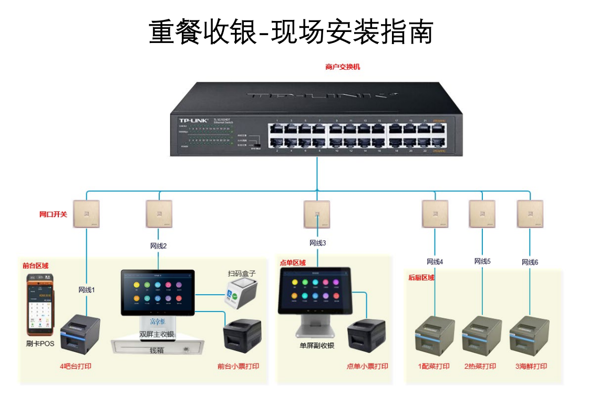
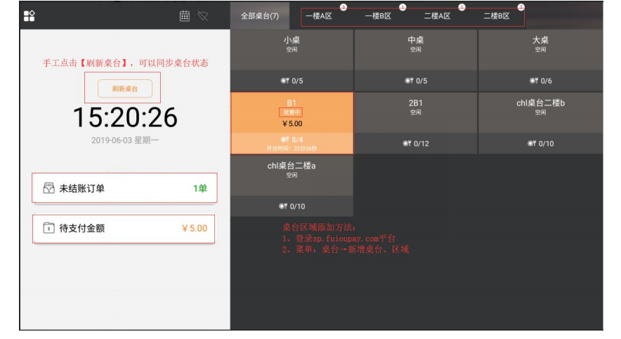
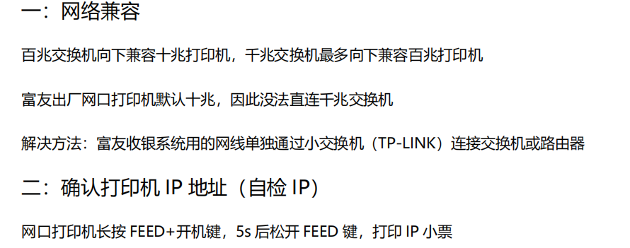

## 方案

## 主，副收银
按商户要求设置主收银（一般放置收银台的为主收银），副收银（一般多为只用来点餐，点击设置后要求输入中心服
务器 IP 即主收银的 IP 的地址）

## 培训
1.收银机完成开台，点菜，退菜，打折，下单，换桌，合桌，撤单，折扣+组合支付，全额退款+部分退款，自定义
时间拉商品销售明细+交易报表

流程
1）点击空闲桌台
2）请输入用餐人数
3）选择商品，点击商品，设置商品折扣、规格。（如果折扣=0，表示赠送）
4）点击【确认加菜】，桌台下单成功！打印客单联，同时桌台变为就餐中。如果有绑定厨打，同步打印厨打凭条。

## 注意
