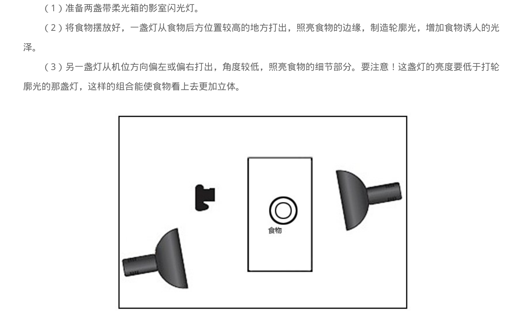
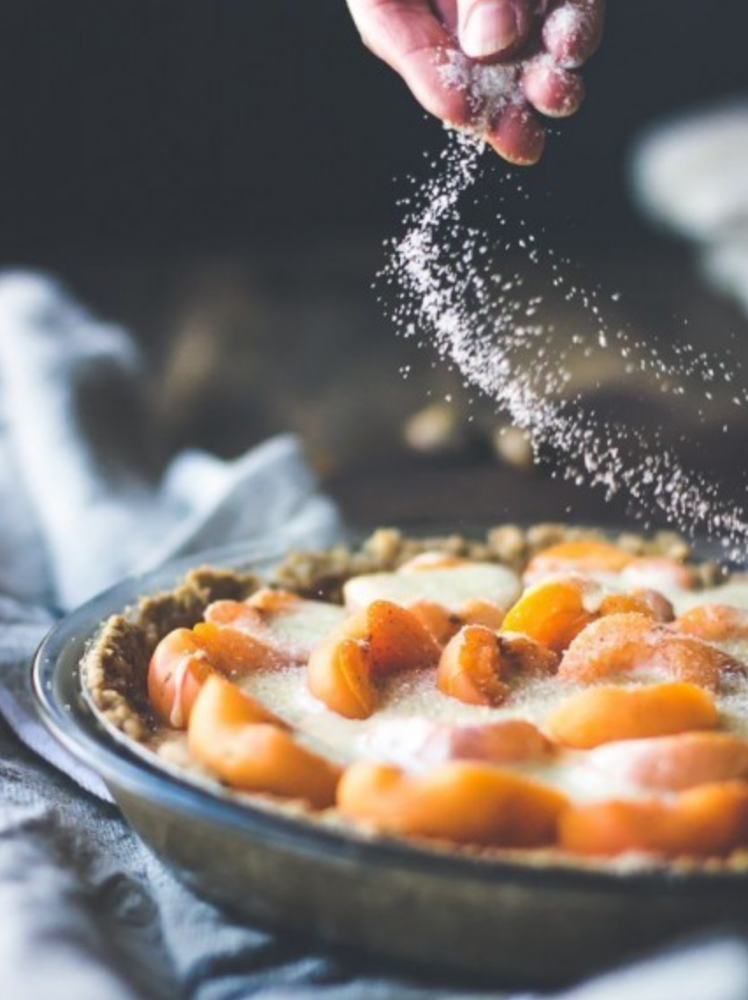

## 注意要点

### 保持食物新鲜
要想让食物看起来新鲜多汁，可以主观的给食物增加一点酱汁，或食用油。

### 使用漫反射光（自然光）

在窗边完成拍摄，暗部使用反光板

### 拍摄手法

1. 全角度俯拍 (方便在图像上做设计,对于单面的光，要用反光板，就可以亮度对称了)
2. 45°俯拍 (方便展现质感，可用微距镜头或开大一点光圈营造浅景深)
3. 低角度拍摄 (留出上层展示空间)

