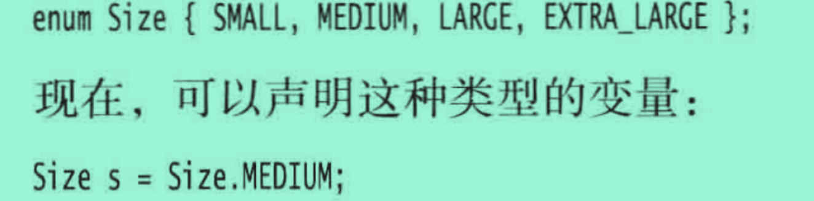

## 枚举类型

## Arrays 

- sort 排序数组
- 

## Math
- 幂运算 (盖头巾，快速增长) pow

### 取模

%为取余（rem），Math.floorMod()为取模（mod）

取余取模有什么区别呢？

对于整型数a，b来说，取模运算或者取余运算的方法都是：

1.求 整数商： c = a/b;

2.计算模或者余数： r = a - c*b.

区别是：

取余运算在计算商值向0方向舍弃小数位

取模运算在计算商值向负无穷方向舍弃小数位

### 三角函数

- sin
- cos
- tan
- atan
- atan2

