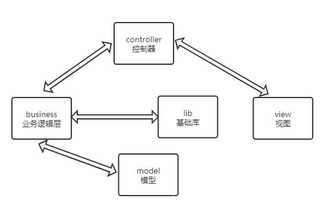
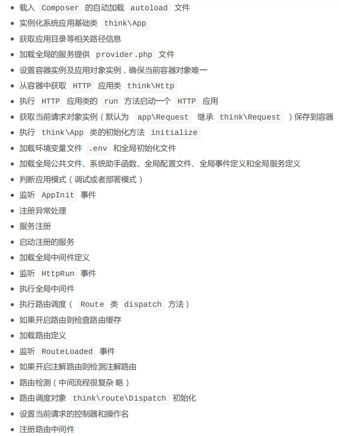

# thinkphp6

用途： 敏捷 web 应用开发

## 架构分层 (模块细分)




## 请求流程



## 架构总览
### 入口文件 (多应用)

public/index.php
public/admin.php (后台)
public/自己添加.php

### 应用(子目录对应多应用)
app/index
app/admin 后台

### 容器 (统一管理对象实例)

### 系统服务 
### 路由 (规划访问地址)
### 控制器 (负责请求的接收和调，模型，并输出。不应过多介入逻辑)
### 模型 (完成实际的业务逻辑和数据封装，并返回与格式无关数据)
### 视图 (调用模板引擎进行内容输出)


## 安装 

> composer create-project topthink/think tp 安装核心
> cd tp  进入tp 目录
> composer require topthink/think-multi-app  加载多应用模块
> composer require topthink/think-view  加载视图模块
> php think run -p 80 运行web服务器


## config (设置)
### environment-variables

think\facade\Env

```
Env::get('database.username');
```
### config-file
think\facade\Config;
```
 Config::get('app.app_name');
 Config::has('route.route_rule_merge');
```
      
### system-config-files

| 文件           | 配置                     |
| -------------- | ------------------------ |
| app.php        | 'show_error_msg' => true |
| cache.php      |                          |
| console.php    |                          |
| cookie.php     |                          |
| database.php   |                          |
| filesystem.php |                          |
| lang.php       |                          |
| log.php        |                          |
| middleware.php | 中间件配置               |
| route.php      |                          |
| session.php    |                          |
| trace.php      |                          |
| view.php       | 视图配置                 |

  
### 多应用
> 每个应用相对保持独立，并且可以支持多个入口文件，应用下面还可以通过多级控制器来维护控制器分组。

``` php
// [ 应用入口文件 ]
namespace think;
 
require __DIR__ . '/../vendor/autoload.php';
 
// 执行HTTP应用并响应
$http = (new  App())->http;
$response = $http->name('admin')->run();
$response->send();
$http->end($response);
```

## 路由
### 路由

路由地址不能跨 应用 (除非采用重定向路由) 
    
```
// 关闭应用的路由功能
'with_route' =>false,
```

### 路由定义

```
Route::get('new/<id>','News/read'); // 定义GET请求路由规则
Route::post('new/<id>','News/update'); // 定义POST请求路由规则
Route::put('new/:id','News/update'); // 定义PUT请求路由规则
Route::delete('new/:id','News/delete'); // 定义DELETE请求路由规则
Route::any('new/:id','News/read'); // 所有请求都支持的路由规则
```

规则表达式

```
Route::rule('/', 'index'); // 首页访问路由
Route::rule('my', 'Member/myinfo'); // 静态地址路由
Route::rule('blog/:id', 'Blog/read'); // 静态地址和动态地址结合
Route::rule('new/:year/:month/:day', 'News/read'); // 静态地址和动态地址结合
Route::rule(':user/:blog_id', 'Blog/read'); // 全动态地址
```
### 路由地址
#### 重定向路由
```
Route::redirect('blog/:id', 'http://blog.thinkphp.cn/read/:id', 302);
```
#### 路由到模板
```
// 路由到模板文件
Route::view('hello/:name', 'index/hello');
```

### 资源路由

### 路由绑定
  可以使用路由绑定简化 URL 或者路由规则的定义
#### 绑定到控制器/操作


#### 绑定到命名空间
## 控制器
### 控制器定义

渲染输出
> halt('输出测试');

### 资源控制器

资源控制器可以让你轻松的创建RESTFul资源控制器，可以通过命令行生成需要的资源控制器，例如生成index应用的Blog资源控制器使用：
php think make:controller index@Blog

或者使用完整的命名空间生成
php think make:controller app\index\controller\Blog

如果只是用于接口开发，可以使用
php think make:controller index@Blog --api

然后你只需要为资源控制器注册一个资源路由：
Route::resource('blog', 'Blog');

## 请求
### 请求对象 
``` php
<?php
namespace app\index\controller;
use think\Request;

class Index
{
    
    public function index(Request $request)
    {
		return $request->param('name');
    }    
}
```

助手函数
``` php
<?php

namespace app\index\controller;

class Index
{
    public function index()
    {
        return request()->param('name');
    }
}
```
### 请求信息

``` php
use think\facade\Request;
// 获取完整URL地址 不带域名
Request::url();
// 获取完整URL地址 包含域名
Request::url(true);
// 获取当前URL（不含QUERY_STRING） 不带域名
Request::baseFile();
// 获取当前URL（不含QUERY_STRING） 包含域名
Request::baseFile(true);
// 获取URL访问根地址 不带域名
Request::root();
// 获取URL访问根地址 包含域名
Request::root(true);
```

获取当前控制器/操作

``` php
Request::controller();
Request::action();
//如果使用了多应用模式，可以通过下面的方法来获取当前应用
app('http')->getName();
```

### 输入变量

``` php
// 获取当前请求的name变量
Request::param('name');
// 获取当前请求的所有变量(经过过滤)
Request::param();
// 获取当前请求未经过滤的所有变量
Request::param(false);
// 获取部分变量
Request::param(['name', 'email']);
// 获取param变量 并用strip_tags函数过滤
Request::param('username','','strip_tags'); 
 // 获取post变量 并用org\Filter类的s
input('post.name','','org\Filter::safeHtml');
afeHtml方法过滤
```
### 请求类型

获取请求类型
| 用途                | 方法      |
|---------------------+-----------|
| 获取当前请求类型    | method    |
| 判断是否GET请求     | isGet     |
| 判断是否POST请求    | isPost    |
| 判断是否PUT请求     | isPut     |
| 判断是否DELETE请求  | isDelete  |
| 判断是否AJAX请求    | isAjax    |
| 判断是否PJAX请求    | isPjax    |
| 判断是否JSON请求    | isJson    |
| 判断是否手机访问    | isMobile  |
| 判断是否HEAD请求    | isHead    |
| 判断是否PATCH请求   | isPatch   |
| 判断是否OPTIONS请求 | isOptions |
| 判断是否为CLI执行   | isCli     |
| 判断是否为CGI模式   | isCgi     |


HTTP 头信息

``` php
$info = Request::header();
echo $info['accept'];
echo $info['accept-encoding'];
echo $info['user-agent'];
```

## 响应
大多数情况,我们不需要关注 Response 对象本身,只需要在控制器的操作方法中返回数据即可
> 使用 return  返回响应类型的数据 return json($data);

| 输出类型     | 快捷方法 | 对应Response类           |
|--------------+----------+--------------------------|
| HTML输出     | response | \think\Response          |
| 渲染模板输出 | view     | \think\response\View     |
| JSON输出     | json     | \think\response\Json     |
| JSONP输出    | jsonp    | \think\response\Jsonp    |
| XML输出      | xml      | \think\response\Xml      |
| 页面重定向   | redirect | \think\response\Redirect |
| 附件下载     | download | \think\response\File     |


响应参数和状态码
``` php
json($data,201);
view($data,401);
```

使用 Response 类的 header 设置响应的头信息
``` php
json($data)->code(201)->header([
'Cache-control' => 'no-cache,must-revalidate'
]);
```

写入Cookie
``` php
response()->cookie('name', 'value', 600);
```

文件下载

``` php
//如果需要设置文件下载的有效期,可以使用
public function download()
{
// 设置300秒有效期
return download('image.jpg', 'my')->expire(300);
}
```

## 数据库
### 删除数据
``` php
// 软删除数据 使用delete_time字段标记删除
Db::name('user')
->where('id', 1)
->useSoftDelete('delete_time',time())
->delete();
```
实际生成的SQL语句可能如下(执行的是 UPDATE 操作):
``` sql
UPDATE `think_user` SET `delete_time` = '1515745214' WHERE `id` = 1
```

## 模型

``` php
//指定主键
protected $pk = 'uid';
// 定义默认的表后缀(默认查询中文数据)
protected $suffix = _cn';

// 设置字段信息
//模型的数据字段和对应数据表的字段是对应的,默认会自动获取(包括字段类型),但自动获取会导致增加一次查询

protected $schema = [
'id' => 'int',
'name' => 'string',
'status' => 'int',
'score' => 'float',
'create_time' => 'datetime',
'update_time' => 'datetime',
];
```
## 视图

``` php
// 模板变量赋值
View::assign('name','ThinkPHP');
View::assign('email','thinkphp@qq.com');
// 或者批量赋值
View::assign([
'name' => 'ThinkPHP',
'email' => 'thinkphp@qq.com'
]);
// 模板输出
return View::fetch('index');
```

``` php
return view('index', [
'name' => 'ThinkPHP',
'email' => 'thinkphp@qq.com'
]);

```
